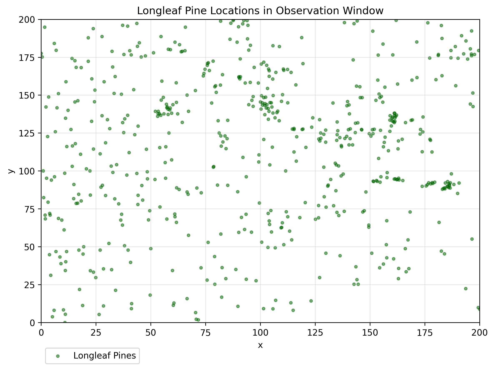
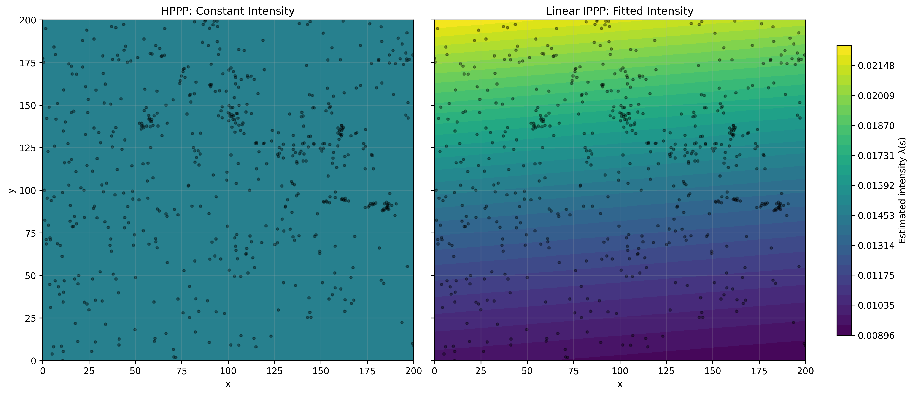
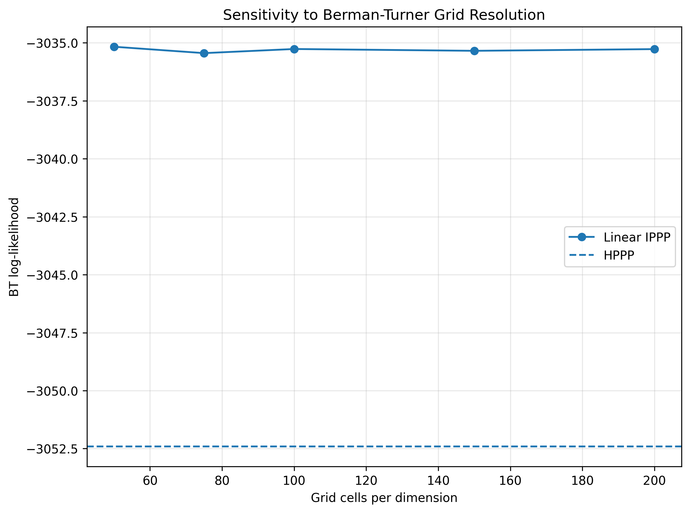

# Neural Poisson Point Process

Neural Inhomogeneous Poisson Point Process implementation in PyTorch.

## Project Layout

The repository is organized around reproducible data acquisition, exploratory
analysis, and generated outputs:

- `scripts/data/`: data acquisition scripts for eBird, GBIF, OpenTopography,
  and the R `spatstat.data` export.
- `exp/`: exploratory analysis scripts, including the initial neural
  IPPP analysis.
- `data/`: downloaded or exported tabular/raster data.
- `images/`: generated figures used by the analysis and this README.

Commands below assume they are run from the project root.

## Data Preparation Commands

```
Rscript scripts/data/load-spatstat-data.R
python scripts/data/gbif-anolis-carolinensis-wake-county.py
python scripts/data/ebird-historic-species.py --region US-NC --start 2020-01-01 --end 2023-12-31 --species-code woothr --output data/wood_thrush_nc_2020_2023.csv
python scripts/data/usgs-nc-state-boundary.py
python scripts/data/opentopography-dem-bbox.py --south 33.85116926668266 --north 36.5881334409244 --west -84.32178200052 --east -75.45981513195132 --output data/nc_usgs30m.tif --boundary data/boundaries/nc_state_boundary.gpkg
python scripts/data/usfs-tcc-canopy-bbox.py --south 33.85116926668266 --north 36.5881334409244 --west -84.32178200052 --east -75.45981513195132 --start-year 2020 --end-year 2023 --output data/nc_tcc_2020_2023.tif --boundary data/boundaries/nc_state_boundary.gpkg
python scripts/data/usgs-hydrography.py --south 33.85116926668266 --north 36.5881334409244 --west -84.32178200052 --east -75.45981513195132 --resolution 100 --output data/nc_hydro_distance_100m.tif --boundary data/boundaries/nc_state_boundary.gpkg
```

## Background

This code models the spatial distribution of Longleaf pine trees using Poisson point process models.

The dataset contains tree locations and diameter-at-breast-height marks for Longleaf pine trees in a rectangular observation window in southern Georgia. The current implementation models both:

1. The spatial point pattern of tree locations
2. The DBH marks conditionally on observed tree locations

The main goal is to compare a homogeneous spatial point process against an inhomogeneous model that allows tree intensity to vary over space. The code also includes a conditional mark model, spatial residual diagnostics, and sensitivity analysis for the Berman-Turner quadrature grid.

## Point Process Framework

Let $W$ denote the observation window and let $s_i = (x_i, y_i)$ denote observed tree locations.

An inhomogeneous Poisson point process is defined by an intensity function:

$$
\lambda(s) \geq 0
$$

where $\lambda(s)$ gives the expected density of events near location $s$.

The IPPP log-likelihood is:

$$
\log L(\lambda)=\sum_{i=1}^{n} \log \lambda(s_i)-\int_W \lambda(u)\,du
$$

The first term rewards high intensity at observed tree locations.  
The second term penalizes total expected intensity over the observation window.

## Assumptions

The spatial point process implementation assumes:

- Nonnegative intensity: $\lambda(s) \geq 0$
- Independent increments across disjoint spatial regions
- A finite expected number of points over the observation window
- No temporal component
- No explicit interaction between points beyond first-order intensity variation

The current spatial model is therefore a first-order intensity model, not a clustering, inhibition, or interaction model.

## Berman-Turner Quadrature Approximation

Rather than directly optimizing the continuous IPPP likelihood, the code uses a Berman-Turner quadrature approximation.

The observation window is divided into grid cells. For each cell:

$$
Y_j \sim \text{Poisson}(w_j \lambda(u_j))
$$

where:

- $Y_j$ is the number of observed points in grid cell $j$
- $u_j$ is the center of grid cell $j$
- $w_j$ is the area of grid cell $j$
- $\lambda(u_j)$ is the fitted intensity at the cell center

The approximate log-likelihood used for fitting is:

$$
\sum_j \left[Y_j \log \lambda(u_j) - w_j \lambda(u_j) \right]
$$

Constants independent of model parameters are omitted.

This converts the IPPP estimation problem into a weighted Poisson-regression-like problem.

## Coordinate Preprocessing

The observed coordinates are standardized before being passed into the PyTorch models:

$$
x^* = \frac{x - \bar{x}}{s_x},
\quad
y^* = \frac{y - \bar{y}}{s_y}
$$

The same transformation is applied to the Berman-Turner grid cell centers and to prediction grids used for plotting.

This improves numerical stability and makes the linear coefficients correspond to standardized coordinate effects.

## Models

### 1. Homogeneous Poisson Point Process

The HPPP assumes constant intensity over the whole observation window:

$$
\lambda(s) = \lambda_0
$$

The maximum likelihood estimate is available in closed form:

$$
\hat{\lambda}_0 = \frac{n}{|W|}
$$

This model serves as the primary spatial baseline.

### 2. Constant Neural IPPP

The constant neural model is a PyTorch version of the HPPP:

$$
\lambda(s) = \exp(\theta)
$$

It has one learnable parameter and is initialized at the HPPP estimate. It is mainly used as a sanity check.

If implemented correctly, its fitted log-likelihood should closely match the closed-form HPPP log-likelihood.

### 3. Linear IPPP

The linear IPPP allows first-order spatial variation in intensity:

$$
\lambda(s) = \exp(\beta_0 + \beta_1 x^* + \beta_2 y^*)
$$

This is a log-linear inhomogeneous Poisson point process.

It is initialized at the HPPP solution by setting:

$$
\beta_1 = 0,
\quad
\beta_2 = 0,
\quad
\beta_0 = \log(\hat{\lambda}_0)
$$

Training then estimates whether a linear spatial trend improves fit over the homogeneous baseline.

### 4. Conditional Mark Model

The conditional mark model describes DBH as a function of location, conditional on the observed tree locations.

The response is standardized log-DBH:

$$
z_i = \frac{\log(m_i) - \overline{\log(m)}}{s_{\log(m)}}
$$

where $m_i$ is the DBH mark for tree $i$.

The model assumes:

$$
z_i \mid s_i \sim \text{Normal}(\mu(s_i), \sigma^2)
$$

with linear conditional mean:

$$
\mu(s_i) = \alpha_0 + \alpha_1 x_i^* + \alpha_2 y_i^*
$$

This gives a conditional marked point process decomposition:

$$
\log L_{\text{joint}} = \log L_{\text{spatial}} + \log L_{\text{marks} \mid \text{locations}}
$$

The mark model does not change the fitted spatial intensity. It models DBH variation among trees after conditioning on the observed locations.

## Optimization

The PyTorch models are optimized with Adam using the negative Berman-Turner log-likelihood for the spatial models and Gaussian negative log-likelihood for the conditional mark model.

For numerical stability, the linear predictor in the Linear IPPP is clamped inside the model's forward pass before exponentiation. This clamp is active during both training and prediction.

$$
\eta = \beta_0 + \beta_1 x^* + \beta_2 y^*
$$

$$
\lambda(s) = \exp(\text{clamp}(\eta))
$$

This prevents extreme intensity values during optimization.

## Model Comparison

The fitted spatial models are compared using:

1. Log-likelihood: higher log-likelihood indicates better fit.
2. AIC: $AIC = 2k - 2\log L$, where $k$ is the number of fitted parameters.
3. BIC: $BIC = k \log(n) - 2\log L$, where $n$ is the number of observed points.
4. Likelihood ratio test: the linear IPPP is compared against the HPPP using $LR = 2(\log L_{\text{linear}} - \log L_{\text{HPPP}})$.

Because the linear model adds two parameters relative to the HPPP, the likelihood ratio test uses $df = 2$.

## Results

The homogeneous Poisson point process, constant neural IPPP, and linear IPPP were fit and compared using the Berman-Turner approximate log-likelihood.

| Model | k | BT Log-Likelihood | AIC | BIC |
|---|---:|---:|---:|---:|
| HPPP | 1 | -3052.4124 | 6106.8247 | 6111.1946 |
| Constant NN | 1 | -3052.4126 | 6106.8252 | 6111.1951 |
| Linear IPPP | 3 | -3035.2646 | 6076.5293 | 6089.6390 |

The constant neural model closely matches the closed-form HPPP likelihood. This provides a sanity check that the Berman-Turner likelihood and PyTorch optimization are behaving as expected.

The linear IPPP improves the Berman-Turner log-likelihood relative to the HPPP:

$$
\Delta \log L = -3035.2646 - (-3052.4124) = 17.1478
$$

Both AIC and BIC are lower for the linear IPPP, indicating that the improvement in likelihood is large enough to justify the two additional spatial trend parameters.

### Likelihood Ratio Test

The linear IPPP was compared against the HPPP using a likelihood ratio test:

$$
LR = 2(\log L_{\text{linear}} - \log L_{\text{HPPP}})
$$

| Comparison | df | LR Statistic | p-value |
|---|---:|---:|---:|
| Linear IPPP vs HPPP | 2 | 34.2954 | 3.57146e-08 |

The likelihood ratio test strongly rejects the homogeneous intensity model. This suggests evidence of first-order spatial inhomogeneity in the Longleaf pine point pattern.

### Fitted Linear IPPP

The fitted linear IPPP coefficients were:

| Parameter | Estimate |
|---|---:|
| Intercept | -4.1976 |
| x coefficient | -0.0205 |
| y coefficient | 0.2100 |

Using standardized coordinates, the fitted intensity model is approximately:

$$
\lambda(s) = \exp(-4.1976 - 0.0205x^* + 0.2100y^*)
$$

The x-direction effect is small and slightly negative. The y-direction effect is larger and positive, indicating that fitted intensity increases primarily along the positive standardized y-axis.

## Conditional Mark Results

The conditional mark model was fit to standardized log-DBH values at the observed tree locations.

| Quantity | Value |
|---|---:|
| Mark log-likelihood | -774.5249 |
| Mark intercept | 0.0000 |
| x coefficient | -0.3670 |
| y coefficient | -0.1552 |
| Mark sigma | 0.9115 |
| Joint spatial + mark log-likelihood | -3809.7896 |

The fitted conditional mean model for standardized log-DBH is approximately:

$$
\mu(s) = 0.0000 - 0.3670x^* - 0.1552y^*
$$

The mark model suggests that, conditional on tree location, standardized log-DBH decreases with both standardized x and standardized y. The x-direction effect is larger in magnitude than the y-direction effect.

This result should be interpreted separately from the spatial intensity model. The spatial model describes where trees occur, while the conditional mark model describes how DBH varies among observed trees.

## Spatial Residual Diagnostics

Pearson residuals were computed on the Berman-Turner grid using:

$$
r_j = \frac{Y_j - \hat{\mu}_j}{\sqrt{\hat{\mu}_j}}
$$

where:

$$
\hat{\mu}_j = w_j \hat{\lambda}(u_j)
$$

Summary diagnostics for the Linear IPPP were:

| Diagnostic | Value |
|---|---:|
| Mean raw residual | 0.000000 |
| Mean Pearson residual | -0.000422 |
| Pearson residual SD | 1.080050 |
| Observed total count | 584 |
| Expected total count | 583.9962 |

The fitted model preserves the total expected count well. The Pearson residual standard deviation is close to 1, which is broadly consistent with a reasonable Poisson residual scale.

The residual surface should be inspected visually for remaining spatial structure. Spatially patterned residuals would suggest missing nonlinear trend, interaction, clustering, inhibition, or unmodeled spatial covariates.

## Berman-Turner Grid Sensitivity

The Linear IPPP was refit using multiple Berman-Turner grid resolutions.

| Grid cells per dimension | Number of cells | Linear BT Log-Likelihood | Linear AIC | Linear BIC | LR Statistic | p-value | beta_x | beta_y | beta_0 |
|---:|---:|---:|---:|---:|---:|---:|---:|---:|---:|
| 50 | 2500 | -3035.1667 | 6076.3335 | 6089.4432 | 34.4912 | 3.238387e-08 | -0.0211 | 0.2106 | -4.1977 |
| 75 | 5625 | -3035.4424 | 6076.8848 | 6089.9945 | 33.9399 | 4.266143e-08 | -0.0210 | 0.2088 | -4.1976 |
| 100 | 10000 | -3035.2646 | 6076.5293 | 6089.6390 | 34.2954 | 3.571464e-08 | -0.0205 | 0.2100 | -4.1976 |
| 150 | 22500 | -3035.3428 | 6076.6855 | 6089.7953 | 34.1392 | 3.861674e-08 | -0.0210 | 0.2094 | -4.1976 |
| 200 | 40000 | -3035.2695 | 6076.5391 | 6089.6488 | 34.2856 | 3.588946e-08 | -0.0205 | 0.2099 | -4.1976 |

The fitted likelihoods, likelihood ratio statistics, and coefficients are stable across grid resolutions. This suggests that the main spatial inference is not sensitive to the chosen Berman-Turner grid resolution.

## Visual Diagnostics

The observed point pattern is shown below.



The fitted intensity comparison shows the HPPP constant intensity surface against the linear IPPP fitted intensity surface. Both panels use a shared color scale.



The Pearson residual surface is shown below.


The Berman-Turner grid sensitivity plot is shown below.



## Current Interpretation

The constant neural model recovers the closed-form HPPP likelihood, validating the Berman-Turner implementation.

The linear IPPP improves the log-likelihood and reduces both AIC and BIC, suggesting evidence of first-order spatial inhomogeneity.

The fitted intensity varies primarily along the standardized y-axis, with a much weaker x-axis effect.

The conditional mark model suggests that standardized log-DBH decreases with both standardized x and standardized y among observed trees.

The Berman-Turner grid sensitivity analysis indicates that the primary spatial inference is stable across tested grid resolutions.

## Current Limitations

The current implementation does not yet model:

- Nonlinear intensity surfaces
- Spatial interaction between trees
- Clustering or inhibition
- Environmental covariates such as soil, elevation, moisture, or raster predictors
- Joint dependence between spatial intensity and marks beyond the conditional decomposition
- Spatial block cross-validation or held-out predictive evaluation
- Inhomogeneous K-functions or simulation-envelope diagnostics

## Train/Test and Validation

The current statistical comparisons use the full dataset. This is appropriate for likelihood-based inference, AIC, BIC, likelihood ratio testing, residual diagnostics, and grid sensitivity analysis.

Train/test splits become more important when fitting more flexible predictive models, such as nonlinear neural IPPPs or higher-capacity mark models.

For spatial point pattern data, ordinary random train/test splits can be misleading because nearby locations may contain similar spatial information. A better next step is spatial block cross-validation, where the observation window is divided into spatial folds and models are evaluated on held-out regions.

## Planned Extensions

Potential next steps include:

- Adding a nonlinear neural network intensity model
- Comparing linear and nonlinear IPPPs with AIC, BIC, and held-out likelihood
- Adding spatial block cross-validation
- Extending the mark model to nonlinear conditional means or heteroskedastic variance
- Adding simulation-based diagnostics
- Adding inhomogeneous K-function diagnostics
- Incorporating spatial covariates
