# Modeling Reported Wood Thrush Intensity with a PyTorch IPPP

In a prior post, I used a controlled spatial point pattern to check that a PyTorch IPPP could reproduce a classical homogeneous baseline and fit a simple inhomogeneous model. Here I use the same framework on a less controlled presence-only dataset, where the points are reported wildlife observations rather than mapped events from a designed study plot.

The data are Wood Thrush observations from eBird in North Carolina from 2020 through 2023. This changes the interpretation of the fitted intensity. A tree in a mapped study plot is a point in a designed observation window. An eBird record is a reported observation. It depends on where Wood Thrush occurred, where observers went, whether the bird was detected, and whether the observation was reported.

For that reason, the fitted surface in this post is reported observation intensity. It is not abundance, and it should not be read as a direct species distribution surface. I write the target informally as

$$
\lambda_{\text{reported}}(s,t,z),
$$

where $s$ is location, $t$ is time, and $z$ represents optional environmental covariates. The model is still an IPPP, but the points being modeled are reported observations.

The IPPP likelihood has the same structure as before:

$$
\log L(\lambda)
=
\sum_i \log \lambda(s_i)
-
\int_W \lambda(u)\,du.
$$

For the temporal runs, the window is effectively a space-time window rather than only a spatial one. The integral is then over locations and time bins. In code, this means the quadrature grid has to carry the right exposure: area for spatial-only models, and area times time-bin width for temporal models.

The data are fit in `EPSG:5070`, an equal-area coordinate reference system. That matters because the likelihood uses area weights. The figures are rendered in longitude and latitude for readability.

The PyTorch framework from the Longleaf post already had the Berman-Turner likelihood. The Wood Thrush version extends the feature matrix. Each quadrature row can contain standardized coordinates, optional raster covariates, and optional cyclic day-of-year features:

```python
def make_features(
    spatial_raw,
    temporal_phase=None,
    covariates_raw=None,
):
    parts = [(spatial_raw - mean) / std]

    if use_covariates:
        covariates = (covariates_raw - covariate_mean) / covariate_std
        parts.append(covariates)

    if not use_temporal:
        return np.column_stack(parts)

    angle = 2.0 * np.pi * temporal_phase
    temporal = np.column_stack([np.sin(angle), np.cos(angle)])
    parts.append(temporal)
    return np.column_stack(parts)
```

The first part standardizes the coordinate columns. If raster covariates are enabled, those values are standardized and appended. If temporal terms are enabled, day of year is converted to a phase on the annual cycle and represented with sine and cosine terms. The sine and cosine pair avoids treating late December and early January as far apart on a linear time axis.

In pseudocode, the feature construction is:

```text
start with standardized x and y
optionally append standardized raster covariates
optionally append sin(day_of_year) and cos(day_of_year)
pass the resulting feature row to the intensity model
```

The temporal phase comes from the observation date:

```python
dates = pd.to_datetime(points[date_column], errors="coerce")
year_lengths = np.where(dates.dt.is_leap_year, 366.0, 365.0)
phase = ((dates.dt.dayofyear.to_numpy(dtype=np.float64) - 1.0) / year_lengths) % 1.0
```

This code maps each observation date to a value between 0 and 1 within its year. Leap years are handled by using 366 days when appropriate. The model then uses this phase through sine and cosine features, not as a raw date.

The linear IPPP is the same log-linear model as before, but the input dimension changes depending on which features are active:

```python
class LinearIPPP(nn.Module):
    def __init__(self, input_dim: int, lambda_init: float):
        super().__init__()
        self.linear = nn.Linear(input_dim, 1)
        with torch.no_grad():
            self.linear.weight.zero_()
            self.linear.bias.fill_(np.log(lambda_init))

    def forward(self, x: torch.Tensor) -> torch.Tensor:
        eta = self.linear(x)
        eta = torch.clamp(eta, min=-50, max=20)
        return torch.exp(eta)
```

Statistically, this is

$$
\lambda_{\text{reported}}(s,t,z)
=
\exp(\beta_0 + \beta^\top x),
$$

where $x$ is the constructed feature vector. Depending on the run, $x$ can include standardized coordinates, raster covariates, and cyclic temporal features. The bias is initialized at the homogeneous baseline, and the weights are initialized at zero, so the model starts from constant reported intensity. The clamp is a numerical guard on the log-intensity, not a model assumption or fitted parameter. I used a lower bound of `-50` here instead of `-20` because the Wood Thrush fits cover a much larger spatial, and sometimes space-time, exposure. The lower bound lets the model assign effectively zero intensity to some quadrature cells without truncating those values as early. The upper bound remains `20` to keep exponentiation from producing very large intensities during optimization.

The nonlinear IPPP uses the same likelihood and the same feature matrix, but replaces the linear predictor with a small neural network:

```python
class NonlinearIPPP(nn.Module):
    def __init__(
        self,
        input_dim: int,
        hidden_dim: int,
        hidden_layers: int,
        lambda_init: float,
        dropout: float = 0.0,
    ):
        super().__init__()
        layers = []
        current_dim = input_dim
        for _ in range(hidden_layers):
            layers.append(nn.Linear(current_dim, hidden_dim))
            layers.append(nn.Tanh())
            if dropout > 0:
                layers.append(nn.Dropout(dropout))
            current_dim = hidden_dim

        output = nn.Linear(current_dim, 1)
        layers.append(output)
        self.network = nn.Sequential(*layers)

        with torch.no_grad():
            output.weight.zero_()
            output.bias.fill_(np.log(lambda_init))

    def forward(self, x: torch.Tensor) -> torch.Tensor:
        eta = self.network(x)
        eta = torch.clamp(eta, min=-50, max=20)
        return torch.exp(eta)
```

This is the first genuinely neural intensity model in these posts. The constructor builds a small feed-forward network from the feature vector to a single log-intensity value. Each hidden layer applies a linear transformation followed by `Tanh`, so the model can learn nonlinear responses to coordinates, temporal phase, and covariates. Optional dropout randomly zeros some hidden activations during training, which is a regularization device rather than a change to the point-process likelihood. The final layer maps the last hidden representation to one number, the log-intensity.

The output layer is initialized so the nonlinear model starts at the same homogeneous reported-intensity baseline as the constant and linear models. Its weights are set to zero, and its bias is set to `log(lambda_init)`. At initialization, the hidden layers do not affect the output because the final weights are zero. During training, the model can move away from that baseline if the Berman-Turner likelihood supports a more structured intensity surface.

In mathematical shorthand, the model represents

$$
\lambda_{\text{reported}}(s,t,z)=\exp(f_\theta(x)),
$$

where $f_\theta$ is the neural network and $x$ is the feature vector. The `forward` method clamps the log-intensity for the same numerical reason as the linear model, then exponentiates it to return a positive intensity. Dropout and weight decay can reduce overfitting, but they do not solve the main identifiability problem in presence-only community-science data: the model can still learn reporting patterns as well as ecological structure.

The Berman-Turner grid also has to change for temporal models. For spatial-only models, each quadrature row represents a spatial cell and has an area weight. For temporal models, each spatial cell is repeated across annual-cycle bins:

```python
t_edges = np.linspace(0.0, 1.0, temporal_bins + 1)
t_centers = 0.5 * (t_edges[:-1] + t_edges[1:])

feature_spatial = np.repeat(spatial_raw, temporal_bins, axis=0)
temporal_phase = np.tile(t_centers, len(spatial_raw))
feature_matrix = make_features(feature_spatial, temporal_phase=temporal_phase)

temporal_width = temporal_duration / temporal_bins
weights = np.repeat(spatial_weights, temporal_bins) * temporal_width
```

The important detail is the weight. A temporal quadrature point represents spatial area multiplied by time-bin width. That keeps the integral term on the same exposure scale as the reported observations.

I first fit coordinate-only spatial models. These use location only, with no temporal terms and no environmental covariates. The homogeneous baseline and the constant PyTorch model match closely: the HPPP Berman-Turner log-likelihood is $-16454.7522$, and the constant model gives $-16454.7520$. The linear IPPP improves the full-window log-likelihood to $-16163.4629$, and the nonlinear IPPP improves it further to $-15801.5928$.

That likelihood result says the nonlinear coordinate-only model fits the full dataset best in-sample. The spatial block cross-validation result is different:

```text
HPPP:           -16484.2557
Constant model: -16484.2489
Linear IPPP:    -16233.1470
Nonlinear IPPP: -16386.8575
```

The diagnostic suggests that the coordinate-only nonlinear model is less reliable when entire spatial regions are held out. The justified conclusion is narrow: reported Wood Thrush observations are not spatially homogeneous, but the more flexible coordinate-only model is not automatically the better predictive model.

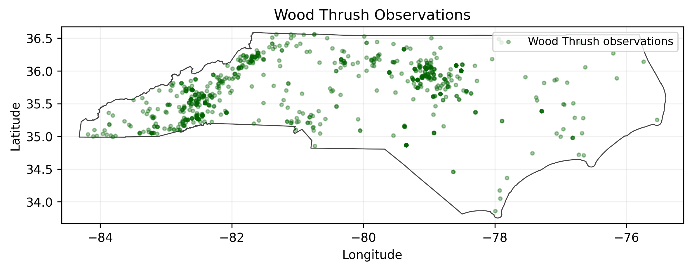

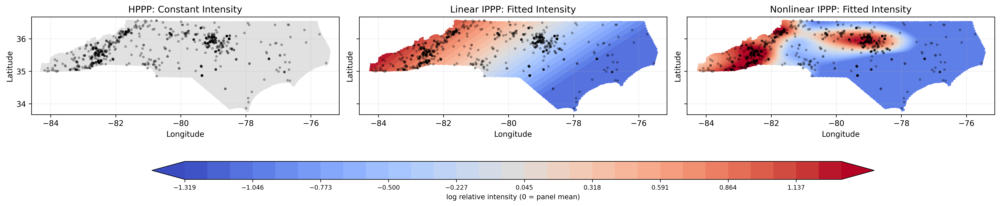

The temporal run adds cyclic day-of-year terms and no raster covariates. Within that run, the nonlinear model has the best full-window likelihood and AIC. The fitted linear temporal model is

$$
\lambda_{\text{reported}}(s,t)
=
\exp(
-26.2553
-0.8310x
+0.2783y
-0.2509\sin_{\text{doy}}
-1.2839\cos_{\text{doy}}
).
$$

The seasonal terms are large relative to the coordinate slopes, which is plausible for a migratory bird. But the model is still fitting reported observations, not abundance.

Spatial block cross-validation favors the linear temporal model over the nonlinear temporal model. The linear temporal held-out total is $-21968.9248$, while the nonlinear temporal held-out total is $-22183.1557$. The total-count simulation diagnostic also favors the linear temporal model. The observed count is 825, the linear temporal simulations have mean 824.33, and the 2.5 percent to 97.5 percent interval is 767.475 to 884.525. The nonlinear temporal simulations have mean 770.50 and an upper interval endpoint of 827.0, so they underpredict the total reported count more often.

Simulation here is a diagnostic after fitting. The code samples Poisson counts from the fitted expected count in each quadrature cell:

```python
with torch.no_grad():
    lambda_vals = model(experiment.quad_coords).numpy().ravel()

expected = experiment.quad_weights_np * lambda_vals
simulated_counts = np.random.poisson(
    expected[None, :],
    size=(n_simulations, len(expected)),
)
simulated_totals = simulated_counts.sum(axis=1)
```

This tests whether the fitted intensity is on the right total-count scale. It does not prove that the reported observation intensity surface represents habitat quality or abundance.

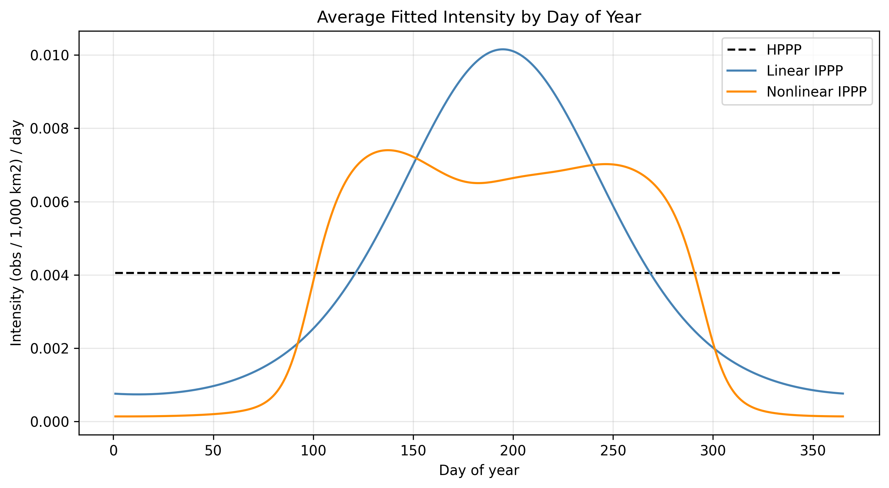

The GIFs are useful visual diagnostics for the fitted annual cycle. They show how the reported observation intensity surface changes over day of year under the fitted model.


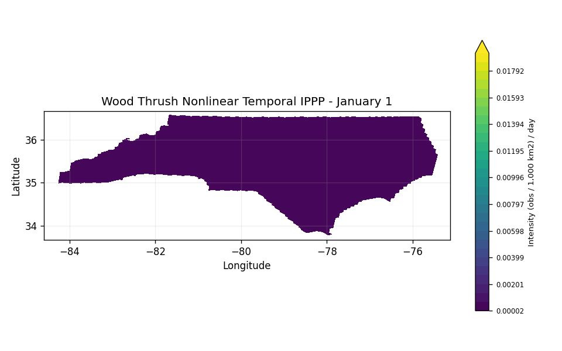

I also fit models with static raster covariates. The documented static covariate run uses median canopy cover, elevation matched to the canopy grid, distance to nearest waterbody, and distance to nearest coastline.

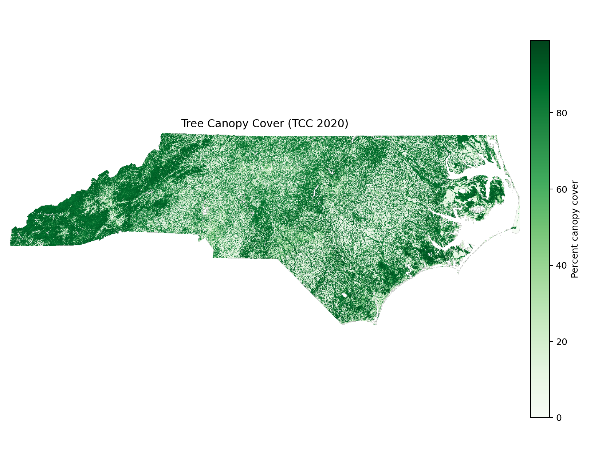

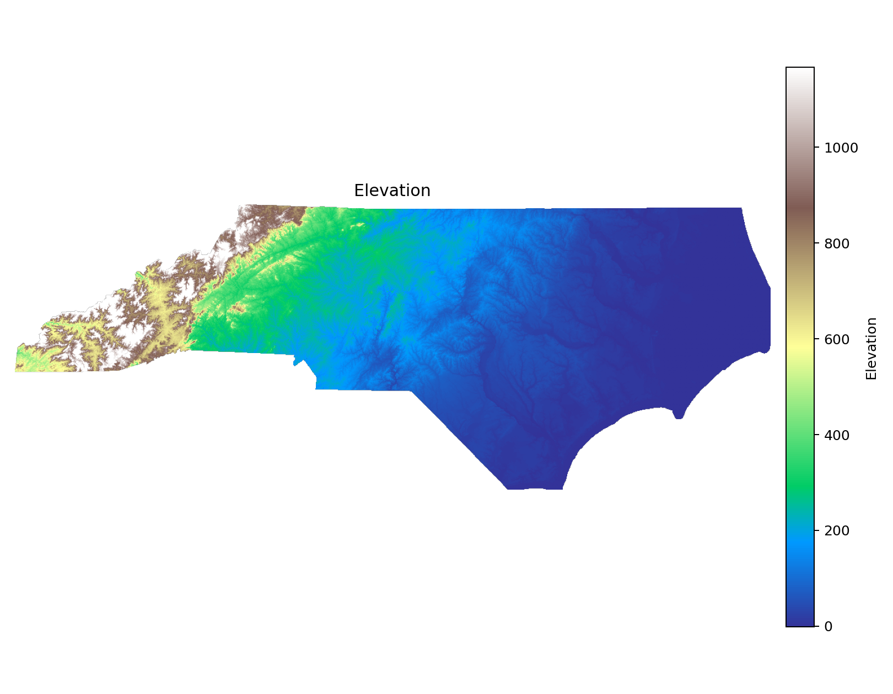

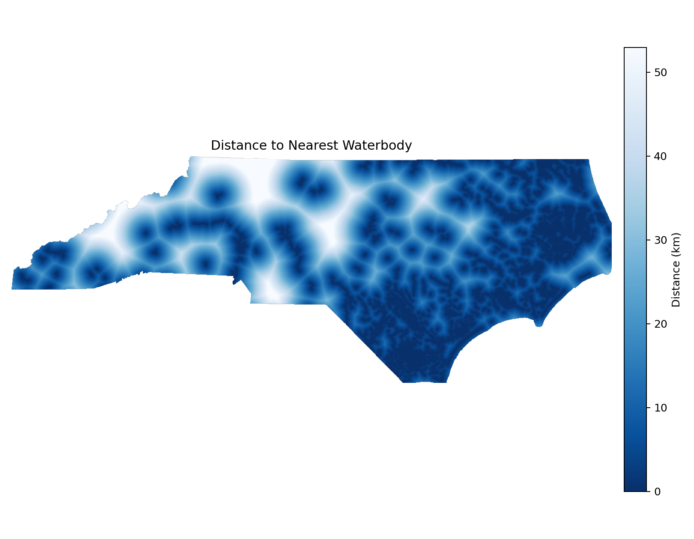

The static covariate run improves full-window likelihood. The nonlinear covariate model improves it the most, from $-16454.7522$ for the HPPP to $-15518.5381$. The spatial block diagnostic is more restrained. The linear static covariate model has held-out total $-16303.8328$, which is better than the HPPP but worse than the coordinate-only linear model. The nonlinear covariate model has held-out total $-16412.7032$ and is poorly calibrated in total-count simulation: the observed count is 825, while the simulated mean is 709.44.

The justified conclusion is that these covariates improve in-sample fit, especially for the nonlinear model, but they do not by themselves solve the validation problem. With presence-only reported observations, covariates, broad geography, observer behavior, and reporting hotspots can be confounded.

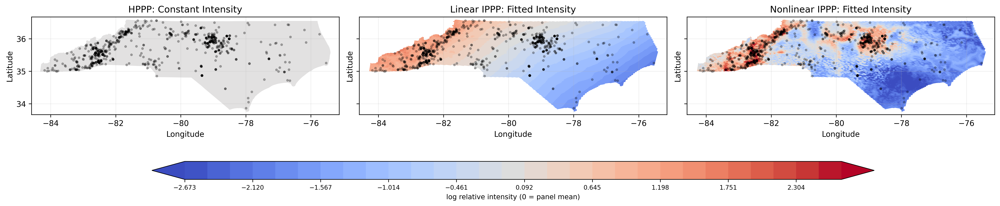

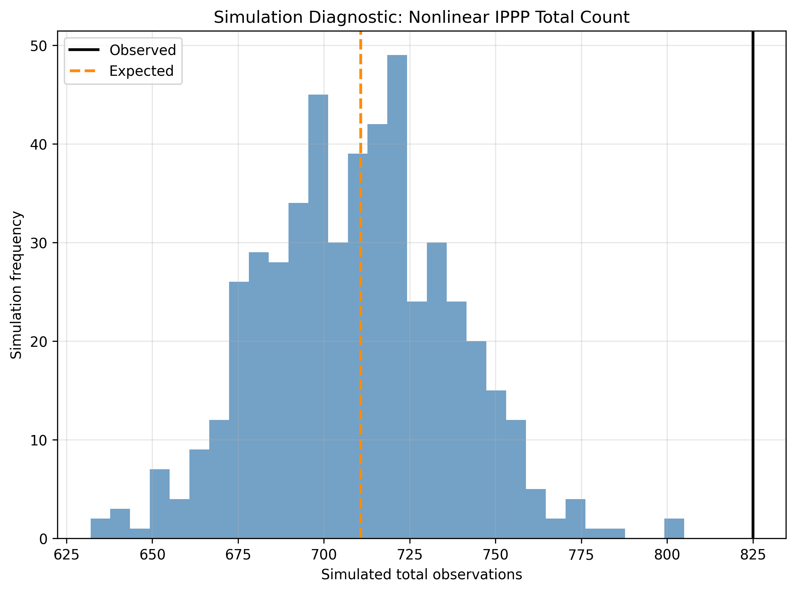

The completed temporal-plus-covariate run combines coordinates, cyclic day-of-year terms, and the selected raster covariates. In that run, the nonlinear model has the best full-window likelihood:

```text
HPPP:           -22466.4252
Constant model: -22466.4238
Linear IPPP:    -21890.1719
Nonlinear IPPP: -21097.4336
```

Spatial block cross-validation again gives a more cautious ranking. The linear model improves held-out likelihood over the HPPP, with held-out total $-22047.6061$ compared with $-22495.9288$. The nonlinear model has held-out total $-22194.3030$, worse than the linear model despite its better full-window likelihood. The linear model's simulated total mean is 824.844 for an observed count of 825, while the nonlinear model's simulated total mean is 662.404.

The metric says the nonlinear temporal-plus-covariate model can fit the observed data very closely in-sample. The diagnostics suggest that this fit does not generalize as well spatially and is not calibrated to the total reported count. The justified conclusion is that the linear temporal-plus-covariate model is currently the more stable fit among these completed runs, even though it is less flexible.

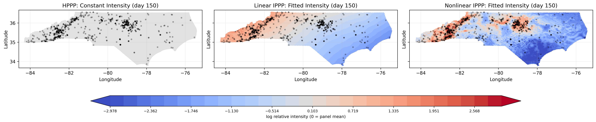

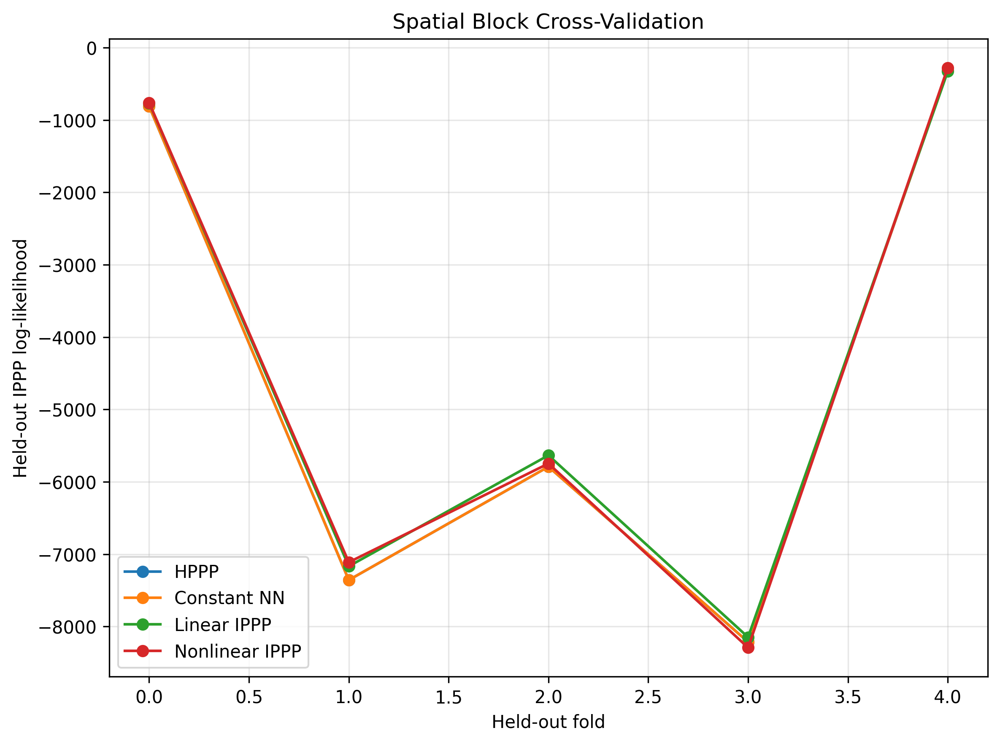

The main result is not that the neural IPPP is better. The nonlinear models often improve full-window likelihood, but the linear models validate more cleanly under spatial block cross-validation and total-count simulation. For eBird-style data, that distinction matters. A flexible model can fit real seasonality, broad spatial structure, habitat covariates, observer effort, reporting hotspots, and residual clustering. The likelihood alone does not separate those explanations.

The current conclusion is modest. Reported Wood Thrush intensity in North Carolina is not homogeneous across space or season. Cyclic temporal features are important, and raster covariates can improve in-sample fit. But in these completed runs, the more flexible neural IPPPs are less stable under the diagnostics than the simpler linear IPPPs. The fitted maps should be read as reported observation intensity surfaces, not abundance maps.

References:

Renner et al., ["Point process models for presence-only analysis"](https://doi.org/10.1111/2041-210X.12352), Methods in Ecology and Evolution, 2015.

Bernabeu, Zhuang, and Mateu, ["Spatio-Temporal Hawkes Point Processes: A Review"](https://link.springer.com/article/10.1007/s13253-024-00653-7), Journal of Agricultural, Biological and Environmental Statistics, 2025.

Zuo et al., ["Transformer Hawkes Process"](https://proceedings.mlr.press/v119/zuo20a/zuo20a.pdf), ICML 2020.
