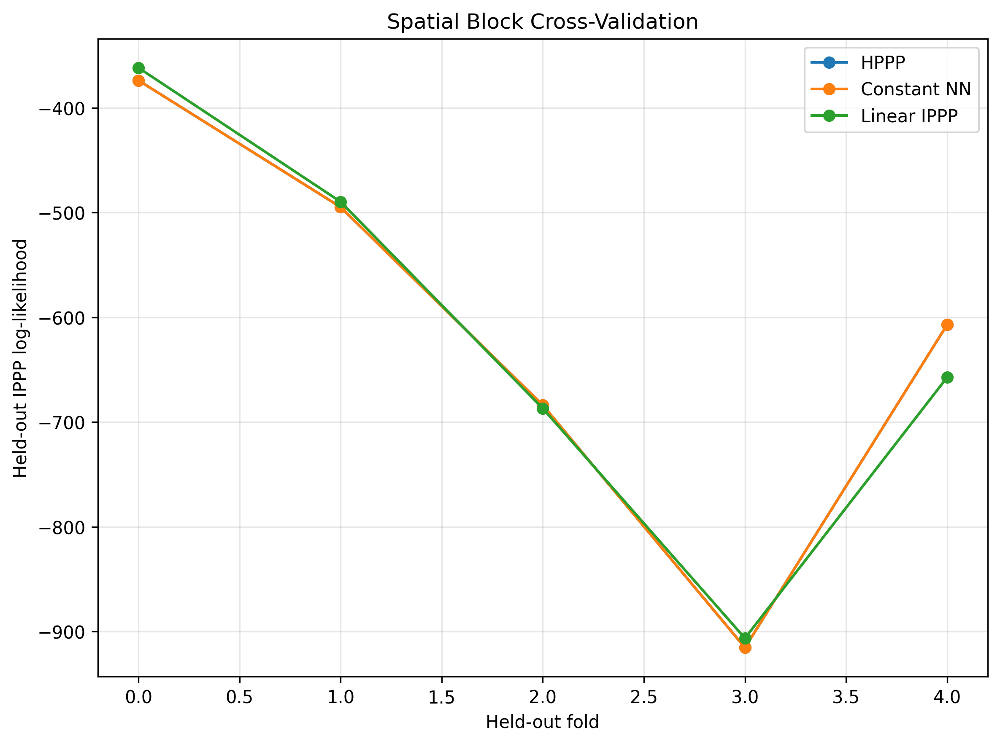

# Using PyTorch to Fit an Inhomogeneous Poisson Point Process


Spatial point patterns show up whenever the data are locations of events: trees in a plot, disease cases in a region, wildfire ignitions, animal observations, crime incidents, or defects on a manufactured surface. A basic modeling question is whether those events occur with roughly constant intensity over the study window, or whether the expected event density changes with location.

One classical way to model this is with an inhomogeneous Poisson point process, or IPPP. The model describes the expected density of events through an intensity function. If the intensity is constant, the model is homogeneous. If the intensity varies over space, the model is inhomogeneous.

I wanted to fit that statistical model in PyTorch. The immediate goal was not to replace the IPPP with a black-box neural network. It was to build a PyTorch framework that could reproduce the classical likelihood, recover the homogeneous baseline, fit a simple inhomogeneous model, and support the same diagnostics and simulation checks.

Longer term, I want this framework to support neural extensions of the same point-process model. The extensions I have in mind include neural IPPPs with richer intensity functions, heterogeneous graph neural networks for multi-species structure, and joint models that try to separate ecological intensity from observer bias and sampling effort.

The example dataset is the Longleaf pine point pattern from R package `spatstat.data`. It is a good implementation dataset because the observation window is simple, the point count is manageable, and the data include a tree-level measurement, DBH, that can be handled as a mark after the spatial model is fit.

An inhomogeneous Poisson point process is defined by an intensity function over a spatial window $W$. If the observed locations are $s_1,\ldots,s_n$, the log-likelihood is

$$
\log L(\lambda)
=
\sum_{i=1}^{n} \log \lambda(s_i)
-
\int_W \lambda(u)\,du.
$$

Here, $s_i$ denotes an observed point location. The symbol $u$ is a dummy spatial location used inside the integral. The integral ranges over all possible locations in $W$, not just the observed points.

The two terms have different jobs. The first term rewards high intensity at the observed locations. The second term penalizes total expected intensity over the study window. Because of that second term, the likelihood depends on the available spatial window, not only on the covariates at observed points. In practice, point process models for presence-only data often approximate this integral with quadrature or background points.

I used a Berman-Turner quadrature approximation. The window is divided into grid cells, and each cell contributes a count and an area weight. Dropping constants that do not depend on the model parameters, the approximate objective is

$$
\sum_j
\left[
Y_j \log \lambda(u_j)
-
w_j \lambda(u_j)
\right],
$$

where $Y_j$ is the observed count in cell $j$, $u_j$ is a representative location for that cell, and $w_j$ is the cell area.

In PyTorch, the core likelihood is small:

```python
def bt_loglik(model, quad_features, quad_counts, quad_weights):
    lambda_vals = model(quad_features).clamp_min(1e-12)
    return (
        quad_counts * torch.log(lambda_vals)
        - quad_weights * lambda_vals
    ).sum()
```

The function takes a fitted or trainable intensity model and evaluates it at the quadrature locations. `quad_features` contains the coordinates or covariates for the quadrature cells. `quad_counts` contains the number of observed points assigned to each cell. `quad_weights` contains the cell areas. The model returns $\lambda(u_j)$ for each quadrature cell, `torch.log(lambda_vals)` gives the log-intensity term, and `quad_weights * lambda_vals` approximates the integral penalty. In pseudocode, the function does this:

```text
for each quadrature cell:
    predict intensity at the cell
    add observed_count * log(predicted_intensity)
    subtract cell_area * predicted_intensity
sum the cell contributions
```

I started with the homogeneous baseline. In that model, the intensity is constant over the whole study window:

$$
\lambda(s)=\exp(\theta).
$$

The PyTorch version is a one-parameter module:

```python
class ConstantIPPP(nn.Module):
    def __init__(self, lambda_init):
        super().__init__()
        self.log_lambda = nn.Parameter(
            torch.tensor(np.log(lambda_init), dtype=torch.float32)
        )

    def forward(self, x):
        lambda0 = torch.exp(self.log_lambda)
        return lambda0.expand(x.shape[0], 1)
```

The module stores the log-intensity as its only trainable parameter. The `forward` method ignores the input coordinates because the intensity is constant across the whole window. It returns the same positive value for every quadrature cell. The closed-form maximum likelihood estimate for this model is

$$
\hat{\lambda}=\frac{n}{\lvert W \rvert}.
$$

This gives a simple sanity check for the implementation. On the Longleaf data, the closed-form HPPP log-likelihood is $-3052.4124$, and the constant PyTorch model gives $-3052.4128$. That near match confirms that the intensity scale, quadrature weights, and optimizer are aligned closely enough for the rest of the analysis.

The second check was a log-linear IPPP:

$$
\lambda(s)
=
\exp(\beta_0 + \beta_1 x^\ast + \beta_2 y^\ast),
$$

where $x^\ast$ and $y^\ast$ are standardized coordinates. This is still a classical log-linear IPPP. The implementation detail is that the linear predictor is written as a small PyTorch module:

```python
class LinearIPPP(nn.Module):
    def __init__(self, input_dim, lambda_init):
        super().__init__()
        self.linear = nn.Linear(input_dim, 1)
        with torch.no_grad():
            self.linear.weight.zero_()
            self.linear.bias.fill_(np.log(lambda_init))

    def forward(self, x):
        eta = self.linear(x).clamp(min=-20, max=20)
        return torch.exp(eta)
```

This module is the log-linear intensity model. `nn.Linear(input_dim, 1)` represents the linear predictor $\eta=\beta_0+\beta_1x^\ast+\beta_2y^\ast$ when the input features are standardized coordinates. The weights are initialized at zero and the bias is initialized at the homogeneous intensity estimate, so the model starts from the HPPP baseline. The `forward` method computes the linear predictor, clamps it to avoid numerical overflow, and exponentiates it so the returned intensity is positive. The clamp bounds, `-20` and `20`, are not model parameters and do not have a statistical interpretation. They are a conservative implementation guard that keeps the exponentiation from producing extreme values if optimization briefly wanders into a bad part of parameter space. In the fitted Longleaf model, the linear predictor stays far from those bounds, so the clamp is not driving the reported estimates. In pseudocode:

```text
start with the homogeneous intensity
learn coordinate slopes during optimization
compute log_intensity = intercept + slope_x * x + slope_y * y
return exp(log_intensity)
```

Initializing the slope coefficients at zero and the intercept at $\log(\frac{n}{\lvert W \rvert})$ makes the model start at the homogeneous solution. Training then estimates whether a first-order spatial trend improves the likelihood.

For Longleaf, the fitted linear IPPP improves the full-window Berman-Turner log-likelihood from $-3052.4124$ to $-3035.2649$. The fitted model is approximately

$$
\lambda(s)
=
\exp(-4.1976 - 0.0205x^\ast + 0.2100y^\ast).
$$

The intensity varies mainly along the standardized $y$-axis.


The likelihood ratio statistic against the homogeneous model is 34.2949 with 2 degrees of freedom, giving a p-value of $3.57 \times 10^{-8}$. I read that as evidence that the linear model fits this observed window better than the homogeneous model. I do not read it as a complete explanation of the point pattern.

After fitting, I used the fitted intensity to simulate total point counts from the approximate IPPP. The observed count is 584, and 500 simulations from the fitted linear model have a mean total count of 584.28 with a 2.5 percent to 97.5 percent interval from 536.9 to 632.05. The observed count falls well inside that envelope.


That simulation check is useful because it tests whether the fitted intensity is on the right overall count scale. It does not test whether the spatial pattern is fully explained. For that, I looked at spatial block cross-validation and an approximate inhomogeneous K-function.

Spatial block cross-validation was less favorable to the linear model. Across five folds, the HPPP held-out total is $-3075.0311$, while the linear IPPP held-out total is $-3102.2426$. The linear trend improves the full-window likelihood, but it does not improve held-out likelihood when entire spatial regions are withheld.



The inhomogeneous K diagnostic also remains above the Poisson reference curve at short radii. That suggests residual clustering after accounting for the fitted first-order intensity trend.


The Longleaf data are also a marked point pattern. Each tree has a location and an associated mark. In this dataset the mark is DBH, or diameter at breast height. The spatial intensity model describes where trees occur. A mark model describes how the extra tree-level measurement varies among the observed trees.

To keep those pieces distinct, I treated standardized log-DBH as a conditional Gaussian response given tree location:

$$
z_i \mid s_i
\sim
\text{Normal}(\alpha_0 + \alpha_1 x_i^* + \alpha_2 y_i^*, \sigma^2).
$$

The PyTorch version mirrors that conditional Gaussian model:

```python
class LinearGaussianMarkModel(nn.Module):
    def __init__(self, input_dim):
        super().__init__()
        self.linear = nn.Linear(input_dim, 1)
        self.log_sigma = nn.Parameter(torch.tensor(0.0))

    def forward(self, x):
        mu = self.linear(x)
        sigma = torch.exp(self.log_sigma)
        return mu, sigma
```

Here, `self.linear` estimates the conditional mean of standardized log-DBH as a function of location. The separate `log_sigma` parameter estimates the residual spread around that mean. As with the intensity models, the variance parameter is stored on the log scale and exponentiated so the returned standard deviation is positive. The Gaussian log-likelihood is then evaluated at the observed tree locations, not over the quadrature grid, because this part of the model is conditional on the trees that were observed.

This conditional mark model does not change the fitted spatial intensity. It describes diameter variation among trees after conditioning on their observed locations. In this run, standardized log-DBH decreases with both standardized coordinates, with fitted coefficients $-0.3670$ for $x^\ast$ and $-0.1552$ for $y^\ast$.

The useful outcome is mostly methodological. A one-parameter PyTorch model recovers the closed-form homogeneous Poisson point process baseline. A PyTorch log-linear model fits a simple inhomogeneous Poisson point process. The fitted model can then be used for likelihood comparison, simulation checks, residual maps, spatial block validation, and second-order diagnostics.

The statistical conclusion is deliberately modest. The Longleaf point pattern shows evidence of first-order inhomogeneity in the full-window likelihood, but a linear intensity trend does not remove all spatial structure and does not improve held-out spatial block likelihood in this run. As a PyTorch implementation, that is still useful: the code reproduces the classical model, and the diagnostics make clear where the simple model stops being adequate.

References:

Renner et al., ["Point process models for presence-only analysis"](https://doi.org/10.1111/2041-210X.12352), Methods in Ecology and Evolution, 2015.

Bernabeu, Zhuang, and Mateu, ["Spatio-Temporal Hawkes Point Processes: A Review"](https://link.springer.com/article/10.1007/s13253-024-00653-7), Journal of Agricultural, Biological and Environmental Statistics, 2025.
