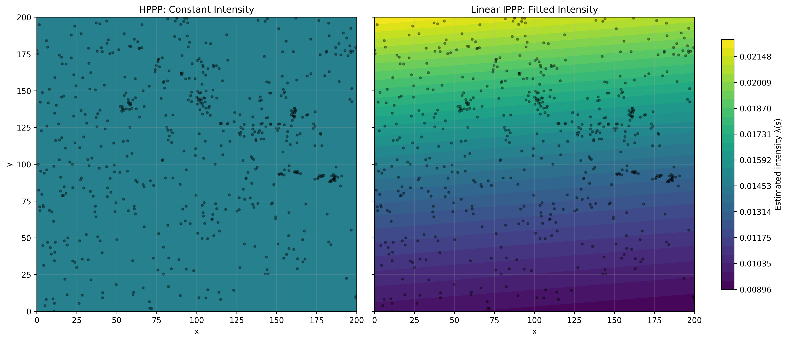
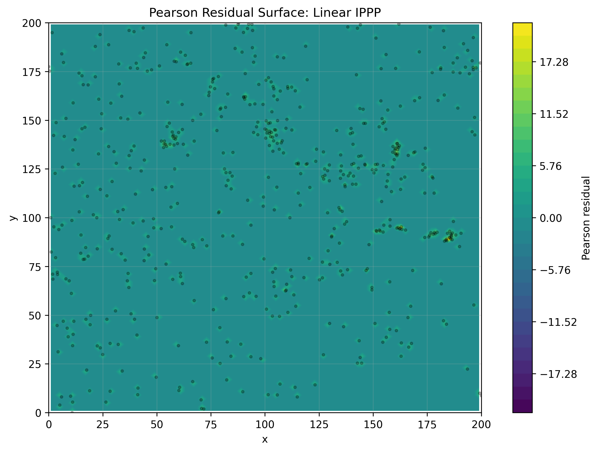
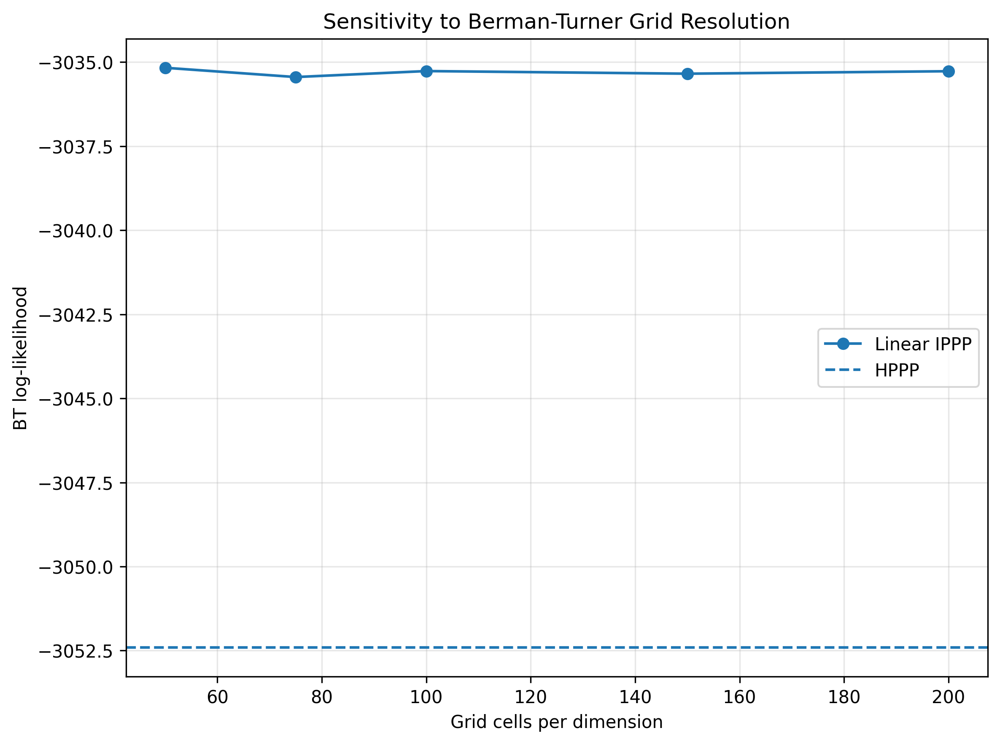
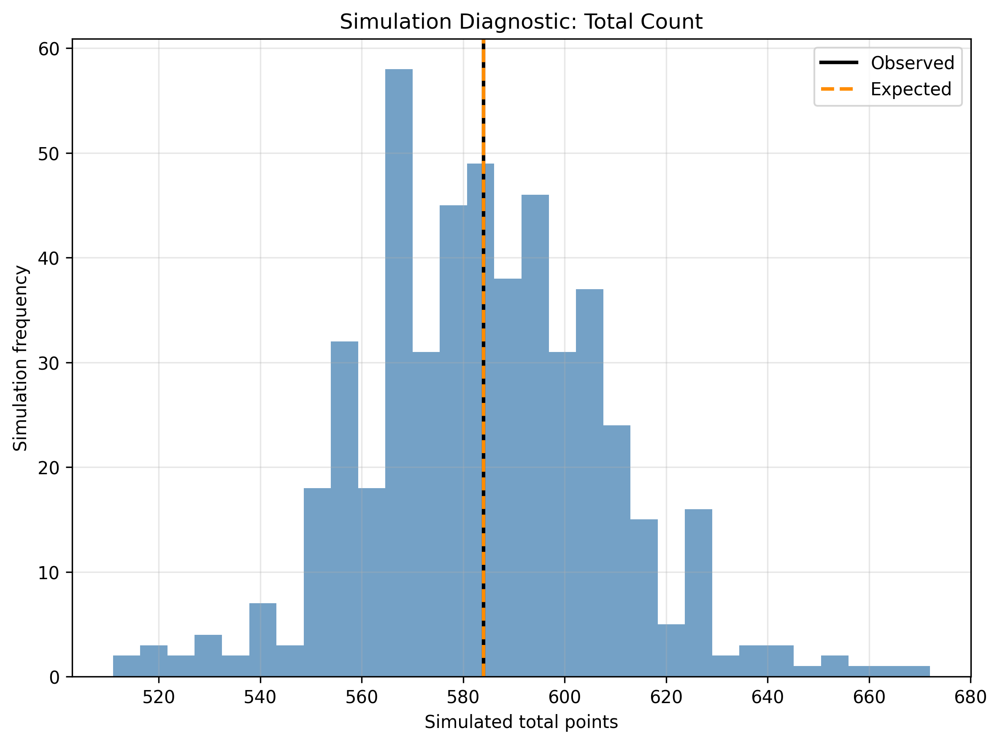
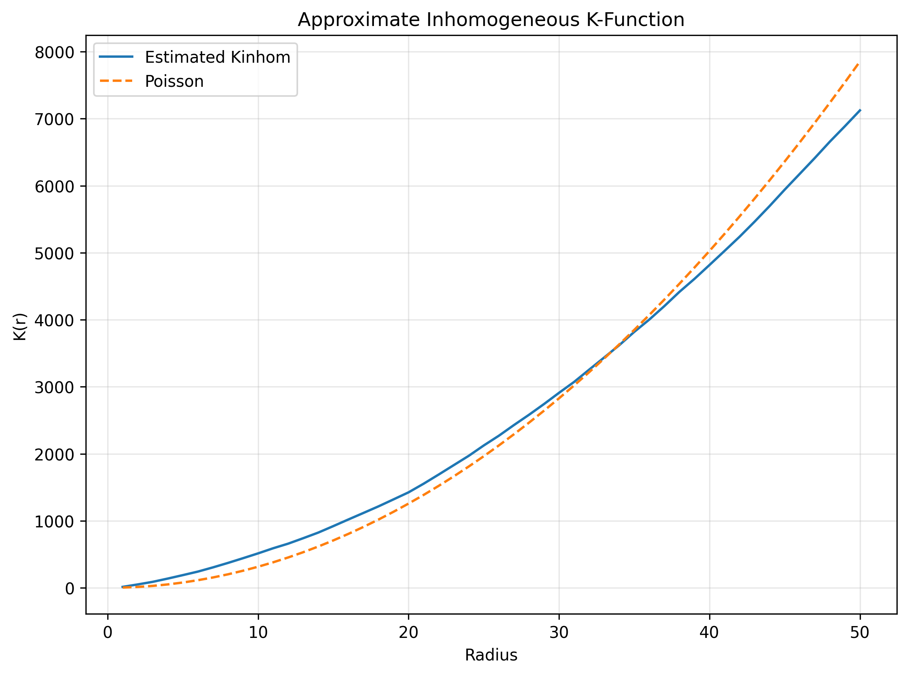

# Longleaf IPPP Results

This document records the current results for the Longleaf pine experiment in
`exp/nippp.py`.

The experiment uses the `spatstat.data` Longleaf pine point pattern exported to
`data/longleaf.csv`. The spatial model is fit with the Berman-Turner quadrature
approximation to the inhomogeneous Poisson point process likelihood. The mark
model treats standardized log-DBH as a conditional Gaussian response given tree
location.

## Model Comparison

| Model | k | BT Log-Likelihood | AIC | BIC |
|---|---:|---:|---:|---:|
| HPPP | 1 | -3052.4124 | 6106.8247 | 6111.1946 |
| Constant NN | 1 | -3052.4128 | 6106.8257 | 6111.1956 |
| Linear IPPP | 3 | -3035.2649 | 6076.5298 | 6089.6395 |

The constant neural model closely matches the closed-form HPPP likelihood,
which validates the Berman-Turner implementation and optimization setup.

The linear IPPP improves the in-sample Berman-Turner log-likelihood relative to
the HPPP:

$$
\Delta \log L = -3035.2649 - (-3052.4124) = 17.1475
$$

## Likelihood Ratio Test

| Comparison | df | LR Statistic | p-value |
|---|---:|---:|---:|
| Linear IPPP vs HPPP | 2 | 34.2949 | 3.57234e-08 |

The likelihood ratio test rejects the homogeneous intensity model, suggesting
evidence of first-order spatial inhomogeneity in the Longleaf point pattern.

## Fitted Linear IPPP

| Parameter | Estimate |
|---|---:|
| Intercept | -4.1976 |
| x coefficient | -0.0205 |
| y coefficient | 0.2100 |

Using standardized coordinates, the fitted intensity is approximately:

$$
\lambda(s) = \exp(-4.1976 - 0.0205x^* + 0.2100y^*)
$$

The fitted intensity varies mainly along the standardized y-axis.

## Conditional Mark Model

| Quantity | Value |
|---|---:|
| Mark log-likelihood | -774.5249 |
| Mark intercept | 0.0000 |
| x coefficient | -0.3670 |
| y coefficient | -0.1552 |
| Mark sigma | 0.9115 |
| Joint spatial + mark log-likelihood | -3809.7898 |

The conditional mark model suggests that standardized log-DBH decreases with
both standardized x and standardized y, conditional on observed tree location.

## Spatial Residual Diagnostics

| Diagnostic | Value |
|---|---:|
| Mean raw residual | -0.000001 |
| Mean Pearson residual | -0.000427 |
| Pearson residual SD | 1.080037 |
| Observed total count | 584 |
| Expected total count | 584.0098 |

The fitted linear IPPP preserves the total expected count well. The Pearson
residual standard deviation is close to 1, but residual maps and second-order
diagnostics should still be inspected for remaining spatial structure.

## Berman-Turner Grid Sensitivity

| Grid cells per dimension | Number of cells | Linear BT Log-Likelihood | Linear AIC | Linear BIC | LR p-value | beta_x | beta_y | beta_0 |
|---:|---:|---:|---:|---:|---:|---:|---:|---:|
| 50 | 2500 | -3035.1670 | 6076.3340 | 6089.4437 | 3.239177e-08 | -0.0211 | 0.2106 | -4.1976 |
| 75 | 5625 | -3035.4420 | 6076.8840 | 6089.9937 | 4.268226e-08 | -0.0210 | 0.2088 | -4.1976 |
| 100 | 10000 | -3035.2649 | 6076.5298 | 6089.6395 | 3.572336e-08 | -0.0205 | 0.2100 | -4.1976 |
| 150 | 22500 | -3035.3428 | 6076.6855 | 6089.7952 | 3.862617e-08 | -0.0210 | 0.2094 | -4.1976 |
| 200 | 40000 | -3035.2695 | 6076.5391 | 6089.6488 | 3.589822e-08 | -0.0205 | 0.2099 | -4.1976 |

The fitted likelihoods, likelihood ratio tests, and coefficients are stable
across the tested quadrature grid resolutions.

## Spatial Block Cross-Validation

| Fold | Test observations | Test area | HPPP heldout log-likelihood | Constant heldout log-likelihood | Linear heldout log-likelihood |
|---:|---:|---:|---:|---:|---:|
| 0 | 59 | 8000.0 | -373.7455 | -373.7455 | -361.6802 |
| 1 | 89 | 8000.0 | -494.7851 | -494.7851 | -489.6904 |
| 2 | 134 | 8000.0 | -683.9086 | -683.9086 | -687.0112 |
| 3 | 186 | 8000.0 | -915.4893 | -915.4893 | -906.4779 |
| 4 | 116 | 8000.0 | -607.1027 | -607.1026 | -657.3829 |

Held-out totals:

| Model | Held-out log-likelihood |
|---|---:|
| HPPP | -3075.0311 |
| Constant NN | -3075.0311 |
| Linear IPPP | -3102.2426 |

The linear IPPP improves the full-window likelihood but performs worse than the
HPPP under spatial block cross-validation. This suggests the linear trend may
not generalize well when entire spatial regions are held out.

## Simulation Diagnostics

| Quantity | Value |
|---|---:|
| Observed total count | 584 |
| Simulated total mean | 584.28 |
| Simulated total 2.5% quantile | 536.9 |
| Simulated total 97.5% quantile | 632.05 |
| Two-sided simulation p-value | 0.9920 |

The observed total count is well inside the simulation envelope generated from
the fitted linear IPPP.

## Inhomogeneous K Diagnostic

| Radius | Kinhom | Poisson theoretical |
|---:|---:|---:|
| 1.0 | 13.5306 | 3.1416 |
| 2.0 | 49.8411 | 12.5664 |
| 3.0 | 88.8618 | 28.2743 |
| 4.0 | 137.5330 | 50.2655 |
| 5.0 | 188.9436 | 78.5398 |

The approximate inhomogeneous K-function is above the Poisson reference curve
at small radii, suggesting residual clustering after the fitted first-order
linear intensity trend.

## Figures

Observed point pattern:

Fitted intensity comparison:

Pearson residual surface:

Berman-Turner grid sensitivity:

Spatial block cross-validation:

Simulation diagnostic:

Approximate inhomogeneous K-function:

## Interpretation

The Longleaf experiment currently supports three main conclusions:

- The Berman-Turner likelihood and PyTorch optimization are behaving as expected,
  because the constant neural model recovers the HPPP baseline.
- The linear IPPP improves in-sample likelihood, AIC, BIC, and the likelihood
  ratio test relative to the HPPP.
- Spatial block cross-validation and the inhomogeneous K diagnostic are more
  cautious: the linear trend does not improve held-out block likelihood and
  residual clustering remains.

The next modeling step should be a nonlinear intensity model, spatial
covariates, or a richer point-process model if residual clustering remains
after covariates are included.
