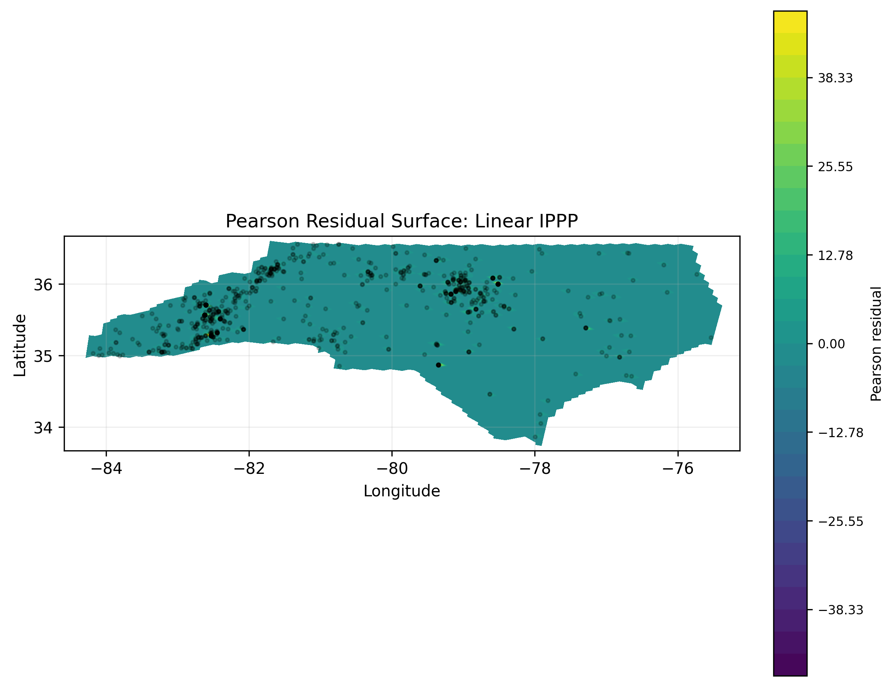
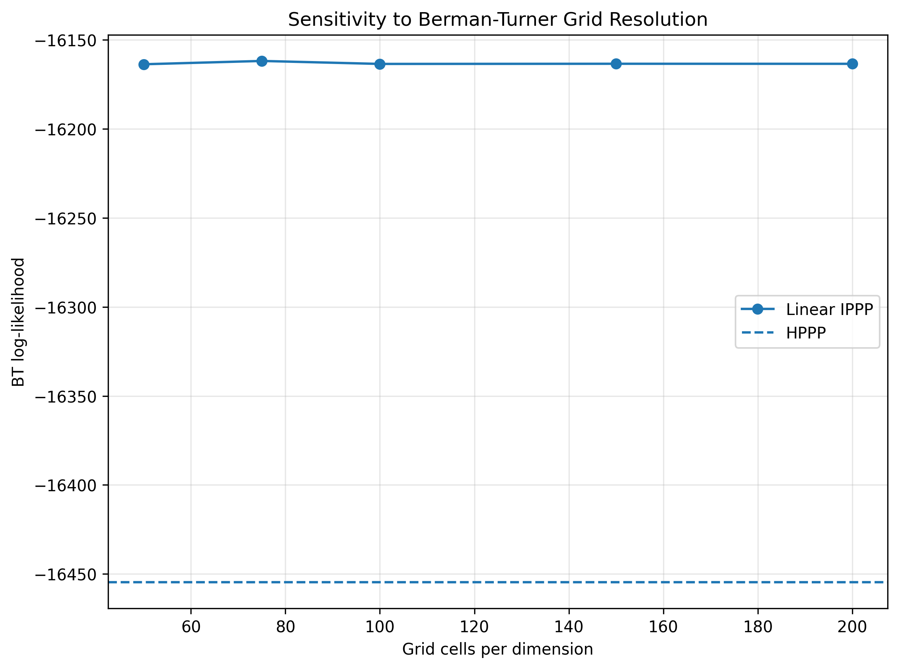
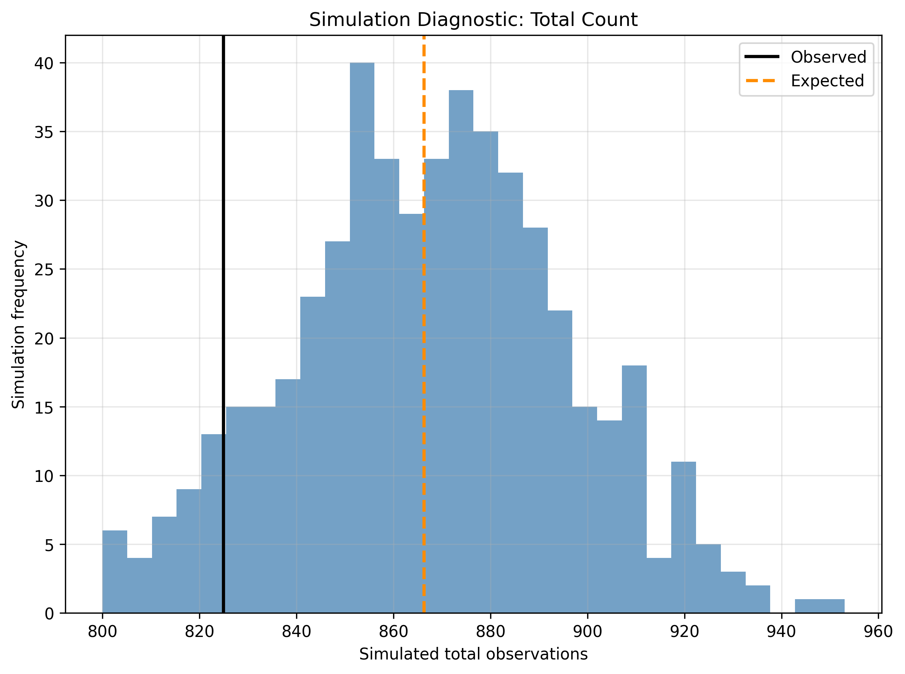
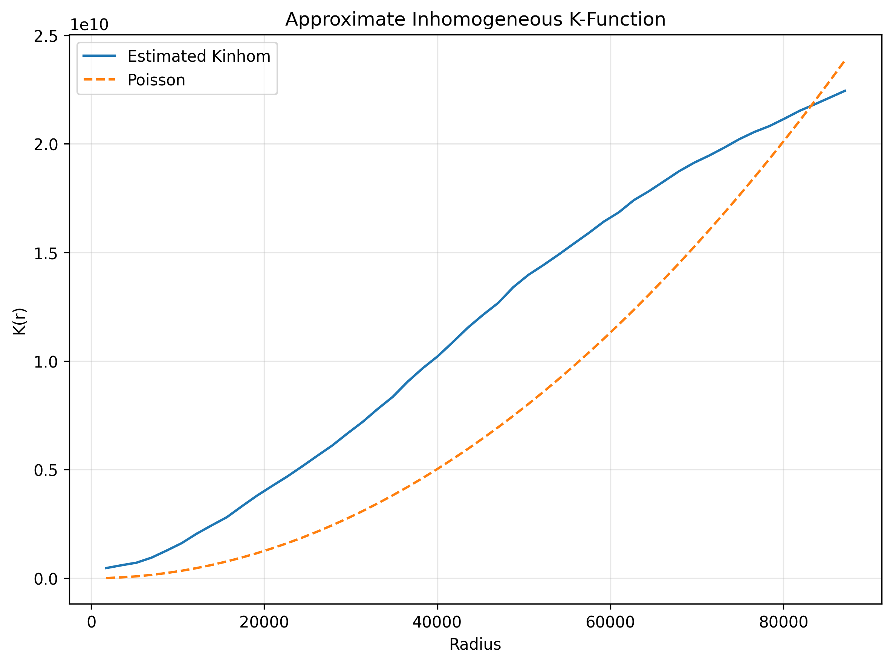

# Wood Thrush North Carolina IPPP Results

This document records the current results for the Wood Thrush North Carolina
experiment in `exp/wood_thrush_nippp.py`.

The experiment uses eBird Wood Thrush observations from 2020 through 2023,
combined into `data/wood_thrush_nc_2020_2023.geojson`. The study window is the
North Carolina state boundary from `data/boundaries/nc_state_boundary.gpkg`.
The model is fit in `EPSG:5070`, an equal-area CRS, and figures are rendered in
longitude/latitude (`EPSG:4326`).

The current model does not yet include temporal terms, effort correction, or
environmental covariates. The fitted IPPP should therefore be interpreted as a
model for reported Wood Thrush observation intensity, not directly as abundance.

## Model Comparison

| Model | k | BT Log-Likelihood | AIC | BIC |
|---|---:|---:|---:|---:|
| HPPP | 1 | -16454.7522 | 32911.5043 | 32916.2197 |
| Constant NN | 1 | -16454.7520 | 32911.5039 | 32916.2193 |
| Linear IPPP | 3 | -16163.4629 | 32332.9258 | 32347.0719 |

The constant neural model closely matches the closed-form HPPP likelihood,
which validates the Berman-Turner implementation and optimization setup.

The linear IPPP improves the in-sample Berman-Turner log-likelihood relative to
the HPPP:

$$
\Delta \log L = -16163.4629 - (-16454.7522) = 291.2893
$$

## Likelihood Ratio Test

| Comparison | df | LR Statistic | p-value |
|---|---:|---:|---:|
| Linear IPPP vs HPPP | 2 | 582.5785 | 3.12379e-127 |

The likelihood ratio test rejects the homogeneous intensity model, suggesting a
strong first-order spatial trend in reported Wood Thrush observations.

## Fitted Linear IPPP

| Parameter | Estimate |
|---|---:|
| Intercept | -18.5498 |
| x coefficient | -0.7463 |
| y coefficient | 0.2244 |

Using standardized coordinates in the analysis CRS, the fitted intensity is
approximately:

$$
\lambda(s) = \exp(-18.5498 - 0.7463x^* + 0.2244y^*)
$$

The fitted linear trend increases toward lower standardized x values and higher
standardized y values. In geographic terms this corresponds to a broad
west/north spatial gradient in reported observation intensity.

## Spatial Residual Diagnostics

| Diagnostic | Value |
|---|---:|
| Mean raw residual | -0.007748 |
| Mean Pearson residual | -0.040925 |
| Pearson residual SD | 1.923150 |
| Observed total count | 825 |
| Expected total count | 866.2914 |

The fitted linear IPPP slightly overpredicts the total expected count relative
to the observed total. The Pearson residual standard deviation is well above 1,
which suggests remaining spatial structure or overdispersion not captured by
the linear first-order trend.

## Berman-Turner Grid Sensitivity

| Grid cells per dimension | Number of cells | Linear BT Log-Likelihood | LR p-value | beta_x | beta_y | beta_0 |
|---:|---:|---:|---:|---:|---:|---:|
| 50 | 2500 | -16163.2559 | 3.771694e-127 | -0.7497 | 0.2274 | -18.5513 |
| 75 | 5625 | -16163.0869 | 5.863702e-128 | -0.7453 | 0.2248 | -18.5478 |
| 100 | 10000 | -16163.4629 | 3.123792e-127 | -0.7463 | 0.2244 | -18.5498 |
| 150 | 22500 | -16163.4688 | 2.860959e-127 | -0.7446 | 0.2237 | -18.5490 |
| 200 | 40000 | -16163.4678 | 2.937398e-127 | -0.7446 | 0.2238 | -18.5489 |

The fitted coefficients and likelihood-ratio results are stable across the
tested Berman-Turner grid resolutions.

## Spatial Block Cross-Validation

| Fold | Test observations | Test area | HPPP heldout log-likelihood | Constant heldout log-likelihood | Linear heldout log-likelihood |
|---:|---:|---:|---:|---:|---:|
| 0 | 29 | 8.530108e+09 | -600.5034 | -600.5044 | -573.2793 |
| 1 | 272 | 3.665885e+10 | -5376.2198 | -5376.2212 | -5251.8013 |
| 2 | 211 | 4.275903e+10 | -4254.1442 | -4254.1453 | -4182.6328 |
| 3 | 304 | 3.831618e+10 | -5998.8494 | -5998.8434 | -5992.6381 |
| 4 | 9 | 1.312526e+10 | -254.5389 | -254.5346 | -232.7955 |

Held-out totals:

| Model | Held-out log-likelihood |
|---|---:|
| HPPP | -16484.2557 |
| Constant NN | -16484.2489 |
| Linear IPPP | -16233.1470 |

The linear IPPP improves held-out spatial block log-likelihood relative to the
HPPP and constant neural model, suggesting that the broad spatial trend
generalizes under this block partition.

## Simulation Diagnostics

| Quantity | Value |
|---|---:|
| Observed total count | 825 |
| Simulated total mean | 867.58 |
| Simulated total 2.5% quantile | 813.475 |
| Simulated total 97.5% quantile | 921.525 |
| Two-sided simulation p-value | 0.1560 |

The observed total count is inside the simulation envelope generated from the
fitted linear IPPP, although the fitted model's expected count is somewhat
higher than the observed count.

## Inhomogeneous K Diagnostic

| Radius | Kinhom | Poisson theoretical |
|---:|---:|---:|
| 1742.0960 | 4.671149e+08 | 9.534415e+06 |
| 3484.1920 | 5.955569e+08 | 3.813766e+07 |
| 5226.2880 | 7.136685e+08 | 8.580973e+07 |
| 6968.3840 | 9.458596e+08 | 1.525506e+08 |
| 8710.4800 | 1.271512e+09 | 2.383604e+08 |

The approximate inhomogeneous K-function is well above the Poisson reference
curve at small radii, suggesting residual clustering after the linear
first-order intensity trend. This is consistent with the need for covariates,
temporal terms, effort correction, or a richer clustered point-process model.

## Figures

Observed point pattern:

Fitted intensity comparison:

Pearson residual surface:

Berman-Turner grid sensitivity:

Spatial block cross-validation:

Simulation diagnostic:

Approximate inhomogeneous K-function:

## Interpretation

The Wood Thrush experiment currently supports four main conclusions:

- The Berman-Turner likelihood and PyTorch optimization are behaving as expected,
  because the constant neural model recovers the HPPP baseline.
- The linear IPPP substantially improves in-sample likelihood, AIC, BIC, and
  likelihood-ratio fit relative to the HPPP.
- Spatial block cross-validation also favors the linear IPPP, so the broad
  spatial trend is not only an in-sample artifact under this fold structure.
- Residual diagnostics and the approximate inhomogeneous K-function indicate
  remaining spatial structure, so the current linear spatial model is still
  incomplete.

The next modeling steps should add seasonal/temporal terms, observer-effort or
sampling-bias controls, and environmental covariates such as canopy, elevation,
distance to water, and distance to coast.
