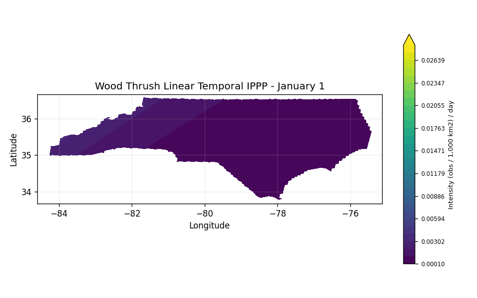
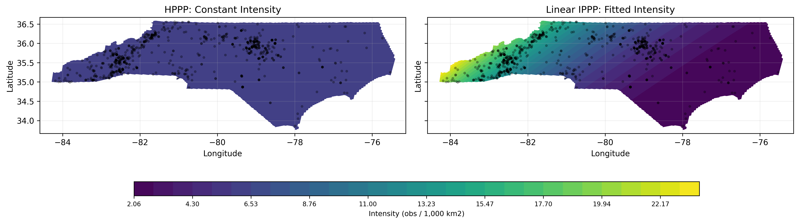
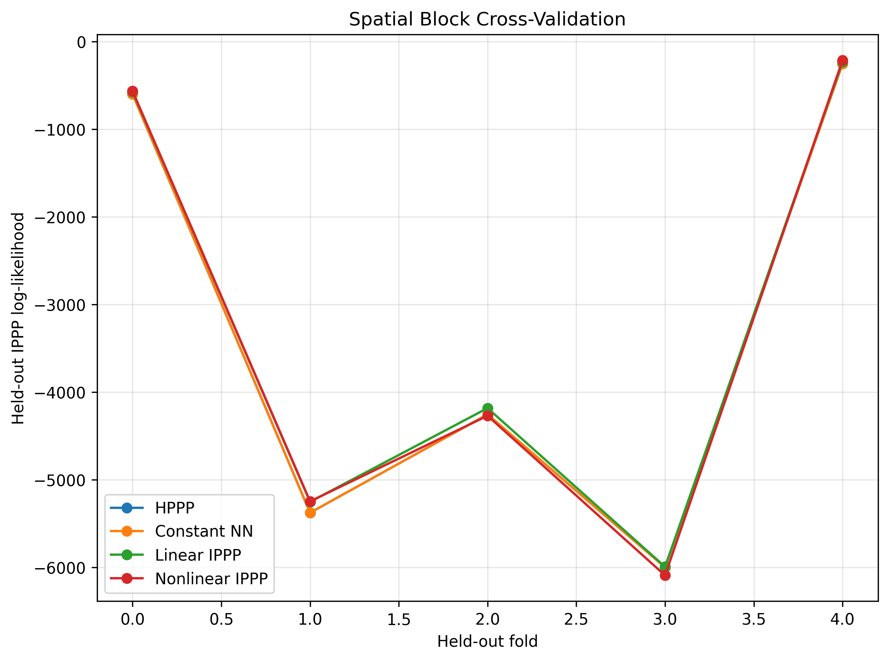
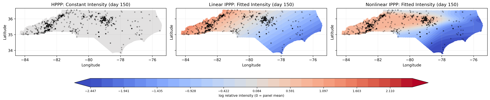
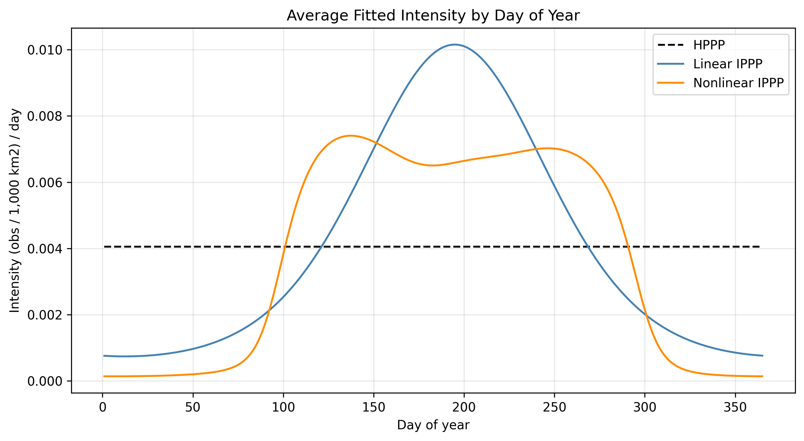
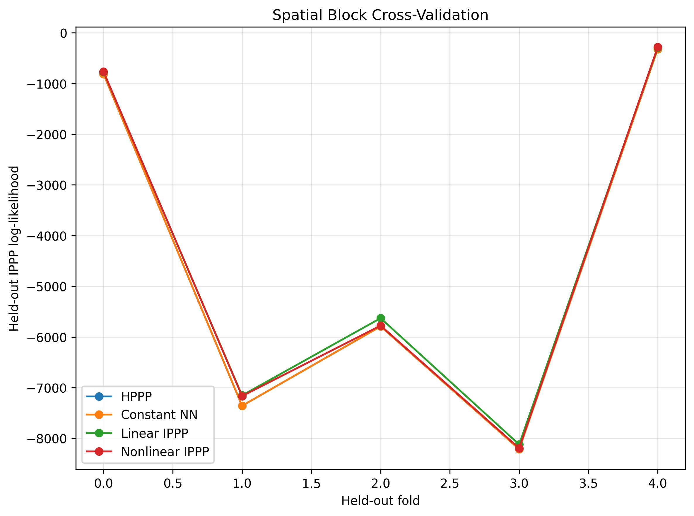
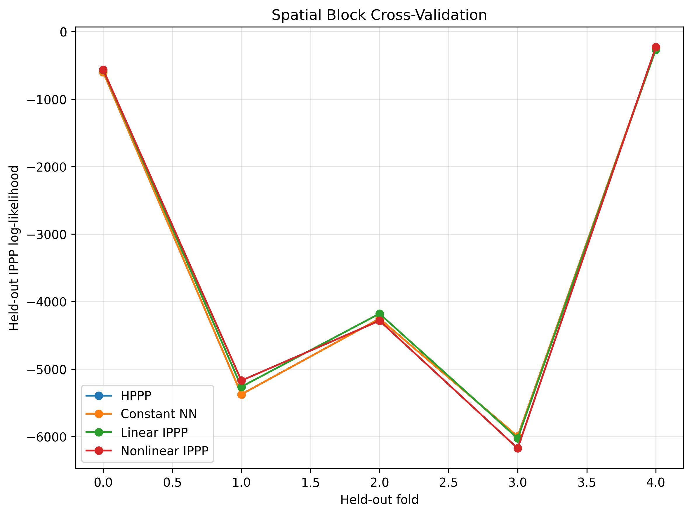
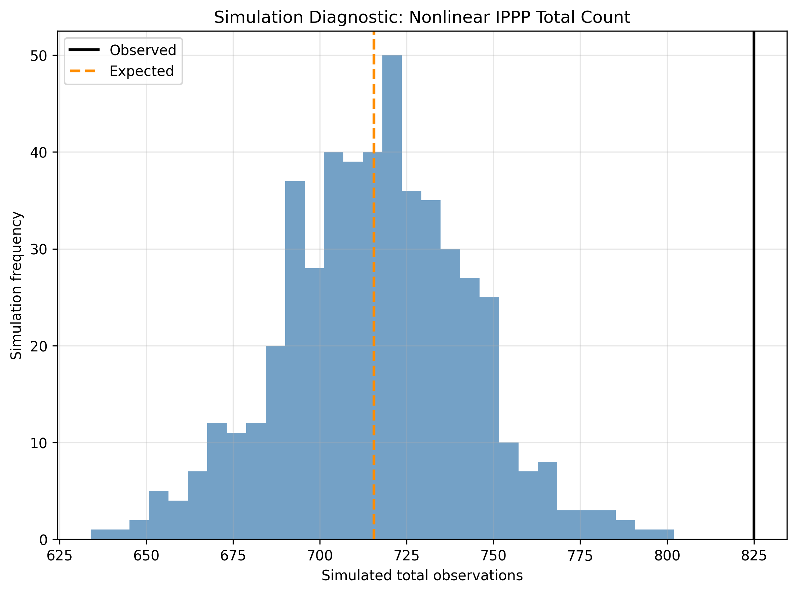

# Wood Thrush North Carolina IPPP Results

This document records the current Wood Thrush North Carolina experiments in
[exp/wood_thrush_nippp.py](../exp/wood_thrush_nippp.py). The data are eBird
Wood Thrush observations from 2020 through 2023, clipped to the North Carolina
state boundary in `data/boundaries/nc_state_boundary.gpkg`.

Models are fit in `EPSG:5070`, an equal-area CRS. Figures are rendered in
longitude/latitude (`EPSG:4326`). These are models for reported observation
intensity, not abundance, because observer effort and detection probability are
not yet modeled.

Likelihoods should be compared within a run. The temporal run uses a
space-time exposure, while the static spatial and covariate runs use spatial
exposure only, so their raw likelihood scales are different.

## Runs

Coordinate-only spatial model:

```powershell
python exp/wood_thrush_nippp.py --input data/wood_thrush_nc_2020_2023.geojson --boundary data/boundaries/nc_state_boundary.gpkg --analysis-crs EPSG:5070 --plot-crs EPSG:4326 --cv-blocks-per-dim 5 --cv-folds 5 --simulation-count 500 --k-radii 50 --epochs-nonlinear 10000 --hidden-dim 16 --hidden-layers 1 --dropout 0.10 --nonlinear-lr 5e-4 --nonlinear-weight-decay 1e-3
```

Temporal, no covariates:

```powershell
python exp/wood_thrush_nippp.py --input data/wood_thrush_nc_2020_2023.geojson --boundary data/boundaries/nc_state_boundary.gpkg --analysis-crs EPSG:5070 --plot-crs EPSG:4326 --image-dir images/wood_thrush_nippp_temporal --cv-blocks-per-dim 5 --cv-folds 5 --simulation-count 500 --k-radii 50 --epochs-nonlinear 10000 --hidden-dim 16 --hidden-layers 1 --dropout 0.10 --nonlinear-lr 5e-4 --nonlinear-weight-decay 1e-3 --temporal-bins 12 --plot-day-of-year 150
```

Static spatial covariates, no temporal terms:

```powershell
python exp/wood_thrush_nippp.py --input data/wood_thrush_nc_2020_2023_covariates.geojson --boundary data/boundaries/nc_state_boundary.gpkg --analysis-crs EPSG:5070 --plot-crs EPSG:4326 --image-dir images/wood_thrush_nippp_covariates --no-temporal --covariate-raster data/nc_covariate_stack.tif --covariates canopy_median nc_usgs30m_match_tcc distance_to_waterbody_m distance_to_coastline_m --cv-blocks-per-dim 5 --cv-folds 5 --simulation-count 500 --k-radii 50 --epochs-nonlinear 10000 --hidden-dim 16 --hidden-layers 1 --dropout 0.10 --nonlinear-lr 5e-4 --nonlinear-weight-decay 1e-3
```

## Coordinate-Only Spatial

This run uses spatial coordinates only. It has no temporal terms and no
environmental covariates.

| Model | k | BT Log-Likelihood | AIC | BIC |
|---|---:|---:|---:|---:|
| HPPP | 1 | -16454.7522 | 32911.5043 | 32916.2197 |
| Constant NN | 1 | -16454.7520 | 32911.5039 | 32916.2193 |
| Linear IPPP | 3 | -16163.4629 | 32332.9258 | 32347.0719 |
| Nonlinear IPPP | 65 | -15801.5928 | 31733.1855 | 32039.6855 |

The constant neural model closely matches the HPPP baseline, which is a useful
sanity check for the Berman-Turner setup. The nonlinear model has the best
in-sample likelihood and AIC, but spatial block cross-validation favors the
linear model.

| Model | Held-out log-likelihood |
|---|---:|
| HPPP | -16484.2557 |
| Constant NN | -16484.2489 |
| Linear IPPP | -16233.1470 |
| Nonlinear IPPP | -16386.8575 |

Simulation diagnostics put the observed count inside both simulation envelopes:

| Model | Observed count | Simulated mean | 2.5% | 97.5% | p-value |
|---|---:|---:|---:|---:|---:|
| Linear IPPP | 825 | 867.58 | 813.475 | 921.525 | 0.1560 |
| Nonlinear IPPP | 825 | 784.34 | 727.950 | 837.000 | 0.1520 |

The coordinate-only inhomogeneous K diagnostics remain far above the Poisson
reference curve at short distances, so coordinate-only first-order structure
does not remove the residual clustering.

## Temporal, No Covariates

This run adds cyclic day-of-year terms from `queryDate`. The space-time
exposure covers 1461 days.

| Model | k | BT Log-Likelihood | AIC | BIC |
|---|---:|---:|---:|---:|
| HPPP | 1 | -22466.4252 | 44934.8504 | 44939.5658 |
| Constant NN | 1 | -22466.4238 | 44934.8477 | 44939.5630 |
| Linear IPPP | 5 | -21897.1016 | 43804.2031 | 43827.7800 |
| Nonlinear IPPP | 97 | -21638.2148 | 43470.4297 | 43927.8219 |

| Comparison | df | LR Statistic | p-value |
|---|---:|---:|---:|
| Linear IPPP vs HPPP | 4 | 1138.6473 | 3.17696e-245 |
| Nonlinear IPPP vs Linear IPPP | 92 | 517.7734 | 1.45064e-60 |

The fitted linear temporal model is:

```text
lambda(s,t) = exp(-26.2553 - 0.8310*x + 0.2783*y - 0.2509*sin_doy - 1.2839*cos_doy)
```

The seasonal terms are large relative to the spatial slope terms, which is
expected for a migratory species. Within the temporal run, the nonlinear model
has the best in-sample likelihood and AIC. The spatial block CV totals,
however, favor the linear temporal model.

| Model | Held-out log-likelihood |
|---|---:|
| HPPP | -22495.9288 |
| Constant NN | -22495.9177 |
| Linear IPPP | -21968.9248 |
| Nonlinear IPPP | -22183.1557 |

Residual and simulation diagnostics:

| Model | Mean raw residual | Mean Pearson residual | Pearson SD | Expected count |
|---|---:|---:|---:|---:|
| Linear IPPP | -0.000000 | -0.005514 | 1.127382 | 825.0011 |
| Nonlinear IPPP | 0.000833 | -0.004867 | 0.987162 | 771.7240 |

| Model | Observed count | Simulated mean | 2.5% | 97.5% | p-value |
|---|---:|---:|---:|---:|---:|
| Linear IPPP | 825 | 824.33 | 767.475 | 884.525 | 1.0000 |
| Nonlinear IPPP | 825 | 770.50 | 716.000 | 827.000 | 0.0680 |

Approximate inhomogeneous K diagnostics:

| Model | Radius | Kinhom | Poisson theoretical |
|---|---:|---:|---:|
| Linear IPPP | 1742.0960 | 5.745307e+08 | 9.534415e+06 |
| Linear IPPP | 3484.1920 | 7.170795e+08 | 3.813766e+07 |
| Linear IPPP | 5226.2880 | 8.460975e+08 | 8.580973e+07 |
| Linear IPPP | 6968.3840 | 1.114605e+09 | 1.525506e+08 |
| Linear IPPP | 8710.4800 | 1.478930e+09 | 2.383604e+08 |
| Nonlinear IPPP | 1742.0960 | 7.027386e+08 | 9.534415e+06 |
| Nonlinear IPPP | 3484.1920 | 7.884626e+08 | 3.813766e+07 |
| Nonlinear IPPP | 5226.2880 | 8.679328e+08 | 8.580973e+07 |
| Nonlinear IPPP | 6968.3840 | 1.005714e+09 | 1.525506e+08 |
| Nonlinear IPPP | 8710.4800 | 1.182632e+09 | 2.383604e+08 |

Temporal animations:




The GIFs show the fitted cyclic day-of-year pattern with no observation points
or boundary overlay. They are useful for checking the seasonal migration
pattern visually, while the CV and simulation summaries above remain the main
model diagnostics.

## Static Covariates, No Temporal Terms

This run adds static spatial covariates from `data/nc_covariate_stack.tif`:

| Covariate | Description |
|---|---|
| `canopy_median` | Median canopy cover across the available canopy years |
| `nc_usgs30m_match_tcc` | Elevation matched to the canopy grid |
| `distance_to_waterbody_m` | Distance to nearest waterbody, meters |
| `distance_to_coastline_m` | Distance to nearest coastline, meters |

| Model | k | BT Log-Likelihood | AIC | BIC |
|---|---:|---:|---:|---:|
| HPPP | 1 | -16454.7522 | 32911.5043 | 32916.2197 |
| Constant NN | 1 | -16454.7520 | 32911.5039 | 32916.2193 |
| Linear IPPP | 7 | -16145.4902 | 32304.9805 | 32337.9882 |
| Nonlinear IPPP | 129 | -15517.5254 | 31293.0508 | 31901.3352 |

| Comparison | df | LR Statistic | p-value |
|---|---:|---:|---:|
| Linear IPPP vs HPPP | 6 | 618.5238 | 2.35336e-130 |
| Nonlinear IPPP vs Linear IPPP | 122 | 1255.9297 | 1.89588e-187 |

The fitted linear covariate model is:

```text
lambda(s) = exp(
  -18.5753
  - 1.0822*x
  + 0.3120*y
  + 0.0153*canopy_median
  + 0.1964*nc_usgs30m_match_tcc
  + 0.0003*distance_to_waterbody_m
  - 0.3796*distance_to_coastline_m
)
```

The coefficient signs should be interpreted cautiously. The model is still
presence-only, and the quadrature/background distribution defines what
environmental contrast is being learned. Covariates at observation points alone
are not enough; the IPPP likelihood also needs covariates over the study window
to define available habitat.

Spatial block CV totals:

| Model | Held-out log-likelihood |
|---|---:|
| HPPP | -16484.2557 |
| Constant NN | -16484.2489 |
| Linear IPPP | -16308.2251 |
| Nonlinear IPPP | -16422.6430 |

The static covariates improve in-sample fit, especially for the nonlinear
model, but they do not improve held-out spatial block likelihood relative to
the coordinate-only linear model. The covariate nonlinear model is especially
poorly calibrated in total-count simulation.

Residual and simulation diagnostics:

| Model | Mean raw residual | Mean Pearson residual | Pearson SD | Expected count |
|---|---:|---:|---:|---:|
| Linear IPPP | -0.000000 | -0.011902 | 1.990379 | 825.0004 |
| Nonlinear IPPP | 0.020528 | 0.004863 | 1.445846 | 715.6046 |

| Model | Observed count | Simulated mean | 2.5% | 97.5% | p-value |
|---|---:|---:|---:|---:|---:|
| Linear IPPP | 825 | 825.48 | 770.000 | 883.525 | 1.0000 |
| Nonlinear IPPP | 825 | 715.95 | 660.900 | 768.575 | 0.0000 |

Approximate inhomogeneous K diagnostics:

| Model | Radius | Kinhom | Poisson theoretical |
|---|---:|---:|---:|
| Linear IPPP | 1742.0960 | 5.789029e+08 | 9.534415e+06 |
| Linear IPPP | 3484.1920 | 7.279722e+08 | 3.813766e+07 |
| Linear IPPP | 5226.2880 | 8.664795e+08 | 8.580973e+07 |
| Linear IPPP | 6968.3840 | 1.154436e+09 | 1.525506e+08 |
| Linear IPPP | 8710.4800 | 1.541568e+09 | 2.383604e+08 |
| Nonlinear IPPP | 1742.0960 | 9.113403e+08 | 9.534415e+06 |
| Nonlinear IPPP | 3484.1920 | 1.016030e+09 | 3.813766e+07 |
| Nonlinear IPPP | 5226.2880 | 1.081739e+09 | 8.580973e+07 |
| Nonlinear IPPP | 6968.3840 | 1.171494e+09 | 1.525506e+08 |
| Nonlinear IPPP | 8710.4800 | 1.363130e+09 | 2.383604e+08 |

## Figures

Coordinate-only spatial figures:






Temporal figures:







Static covariate figures:






## Current Interpretation

The strongest current result is that Wood Thrush reported observation intensity
is not homogeneous across North Carolina. Coordinate-only spatial trends,
seasonal day-of-year terms, and static environmental covariates all improve
in-sample likelihood relative to the HPPP.

For generalization, the linear models are currently more reliable than the
nonlinear models under spatial block cross-validation. The nonlinear models
often improve in-sample likelihood and residual spread, but their held-out
likelihood and simulation calibration show overfitting or poor count
calibration.

The temporal run is ecologically important because Wood Thrush is migratory,
and the cyclic day-of-year terms produce a well-calibrated total-count
simulation for the linear temporal model. The next modeling step should combine
the temporal terms with the spatial covariates, then reassess spatial block CV,
simulation diagnostics, and the inhomogeneous K-function.
